# 99 Scala Problems

There are lots of questions.

## P09

If I run it like this, the red square button will stay there for a surprising long time.

```scala
    println("Using standard recursion: ")
    println(s"After packing the $lst: \n${pack(lst)}")
```

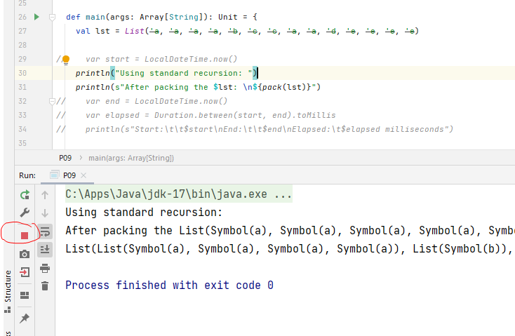

But if I run it like this (with some extra benchmarking code), then it will take much short time to stop.

```scala
    var start = LocalDateTime.now()
    println("Using standard recursion: ")
    println(s"After packing the $lst: \n${pack(lst)}")
    var end = LocalDateTime.now()
    var elapsed = Duration.between(start, end).toMillis
    println(s"Start:\t\t$start\nEnd:\t\t$end\nElapsed:\t$elapsed milliseconds")
```

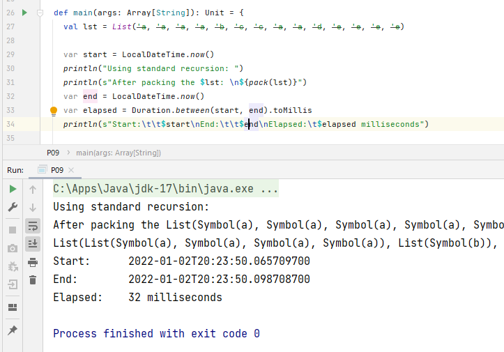

Also, the elapsed time will be different for using the green triangle button on the top right, or using the similar one on the bottom left?

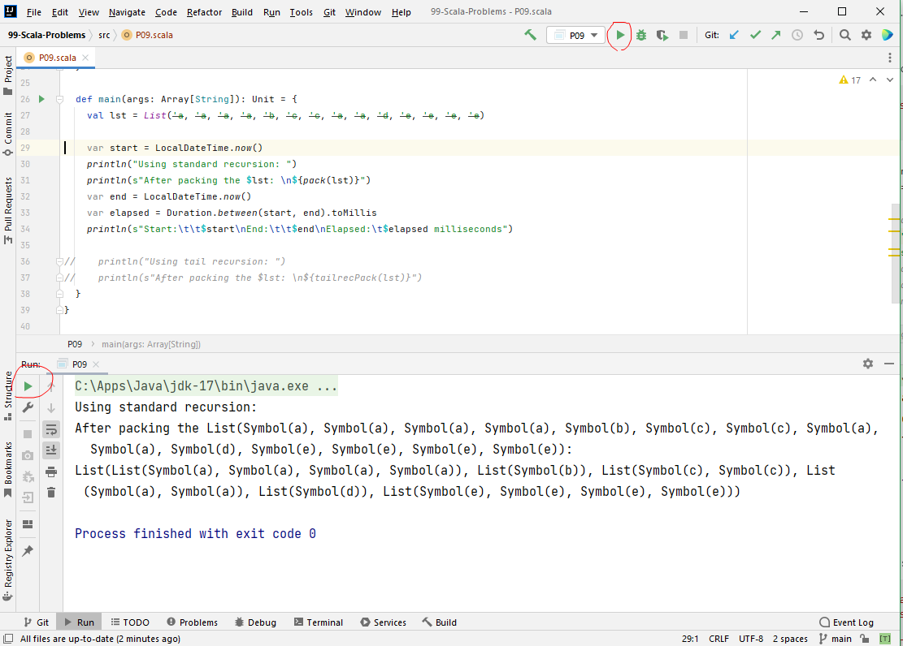

## P25

List to Array

### Issue

IDE compiler doesn't complain, but it has runtime error -

No ClassTag available for T

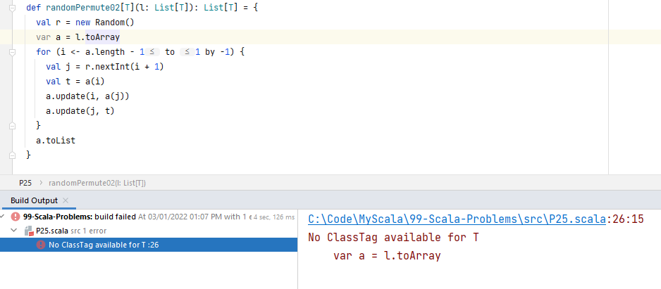

### Root cause

To instantiate an array in a generic context (instantiating an array of T where T is a type parameter), Scala needs to have information at runtime about T, in the form of an implicit value of type ClassTag[T].

### Solution

```
import scala.reflect.ClassTag
```

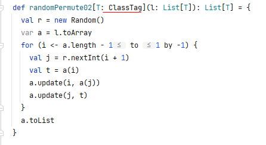

## P26, P27

Need to understand more on the solution!

@ can be used to bind a name to a successfully matched pattern, or subpattern.

## P28

The solution http://aperiodic.net/phil/scala/s-99/p28.scala is not compliable in IJ.

## Where are P29 and P30?

## P31

Be careful of LazyList

Exception: "self-referential LazyList or a derivation thereof has no more elements"

Stream is deprecated

(Since version 2.13.0) Use LazyList (which is fully lazy) instead of Stream (which has a lazy tail only)

#:: is the cons operator for Streams / LazyLists.

In other words, #:: is to streams / LazyLists and :: is to Lists.

```
x #:: xs
```

===>

```
Stream.cons(x, xs)
```

## P36

Map

Additions and updates +, ++, updated, which let you add new bindings to a map or change existing bindings.

List.make(v.\_2, v.\_1)

==>

(v.\_1, v.\_2)

Looks like List.make is a very old method?

## Where are P42, P43, P44 and P45?

## P46

How to get the function name in Scala?

## William Zhi 2021-01-05

Scala case class vs Java record class

mapPar(2)(...)

A => B

Container?

Scala interview:

- Spark

- ?

Scala Stream vs Java Streaming API

Monad?

    - flatMap
    - tailrecM
    - pure

map can be implemented with flatMap

Option

Scala Option vs Java Option

Scala Quill

## P48

P48 (\*\*) Truth tables for logical expressions (3).

Omitted for now.

???

## P49

The reflected binary code (RBC), also known just as reflected binary (RB) or Gray code after Frank Gray, is an ordering of the binary numeral system such that two successive values differ in only one bit (binary digit).

```
Decimal Binary Gray Decimal
of Gray
0 0000 0000 0
1 0001 0001 1
2 0010 0011 3
3 0011 0010 2
4 0100 0110 6
5 0101 0111 7
6 0110 0101 5
7 0111 0100 4
8 1000 1100 12
9 1001 1101 13
10 1010 1111 15
11 1011 1110 14
12 1100 1010 10
13 1101 1011 11
14 1110 1001 9
15 1111 1000 8
```

## P50 (unfinished)

Need to come back for it.

Not done yet.

## Where are P51, P52, P53?

## P44 Omitted

P54 Omitted; our tree representation will only allow well-formed trees.

Score one for static typing.

## Binary Trees

A binary tree is either empty or it is composed of a root element and two successors, which are binary trees themselves.

We shall use the following classes to represent binary trees. An End is equivalent to an empty tree. A Branch has a value, and two descendant trees. The toString functions are relatively arbitrary, but they yield a more compact output than Scala's default. Putting a plus in front of the T makes the class covariant; it will be able to hold subtypes of whatever type it's created for. (This is important so that End can be a singleton object; as a singleton, it must have a specific type, so we give it type Nothing, which is a subtype of every other type.)

```scala
sealed abstract class Tree[+T]
case class Node[+T](value: T, left: Tree[T], right: Tree[T]) extends Tree[T] {
  override def toString = "T(" + value.toString + " " + left.toString + " " + right.toString + ")"
}
case object End extends Tree[Nothing] {
  override def toString = "."
}
object Node {
  def apply[T](value: T): Node[T] = Node(value, End, End)
}
```

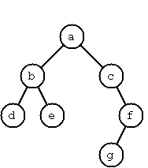

The example tree here can be described as -

```scala
Node('a',
     Node('b', Node('d'), Node('e')),
     Node('c', End, Node('f', Node('g'), End)))
```

A tree with only a root node would be Node('a') and an empty tree would be End.

## P55

print2DUtil needs to be modified further to get a better print in 2D.

## P56

```scala
object Node {
  def apply[T](value: T): Node[T] = Node(value, End, End)
}
```

This makes differences on the compiling.

# P57

```dos
C:\Code\MyScala\99-Scala-Problems\src\P57_2.scala
Tree is already defined as class Tree
sealed abstract class Tree[+T] {
```

Have to move each Tree definition to a separate package to avoid the conflicts.

## Variance : Covariance vs Contravariance vs Invariance

```scala
class Foo[+A] // A covariant class
class Bar[-A] // A contravariant class
class Baz[A]  // An invariant class
```

https://docs.scala-lang.org/tour/variances.html

## Generate-and-Test Paradigm

A method for silving design problems when a complete preliminary design can be performed, then evaluated, and iterate the process if the evaluation is not satisfactory. It can be used only for very simple design problems.

A trial and error method of problem solving where a possible solution is generated and tested to check if it is successful. If it is not successful, then another possible solution is generated and tested and this goes on until a satisfactory solution is found. The solution found may not be optimal and not all possible scenarios are tested.

Generate and Test Search is a heuristic search technique based on Depth First Search with Backtracking which guarantees to find a solution if done systematically and there exists a solution. In this technique, all the solutions are generated and tested for the best solution. It ensures that the best solution is checked against all possible generated solutions.

It is also known as British Museum Search Algorithm as it’s like looking for an exhibit at random or finding an object in the British Museum by wandering randomly.

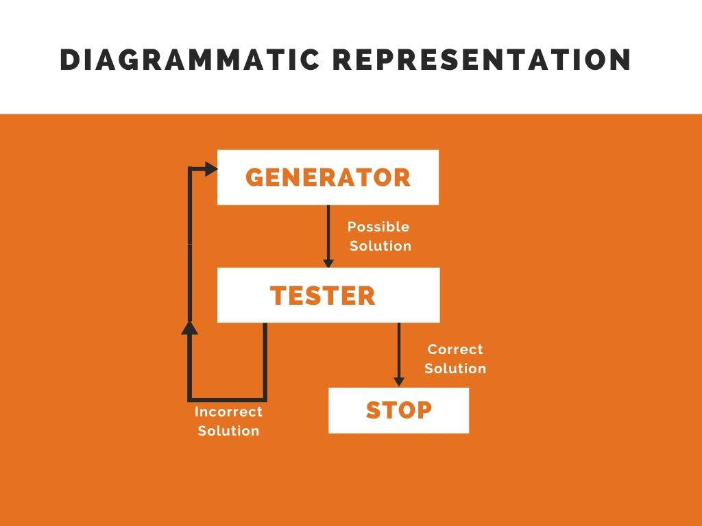

## Types of binary trees

In a completely balanced binary tree, the following property holds for every node: The number of nodes in its left subtree and the number of nodes in its right subtree are almost equal, which means their difference is not greater than one.

In a height-balanced binary tree, the following property holds for every node: The height of its left subtree and the height of its right subtree are almost equal, which means their difference is not greater than one.

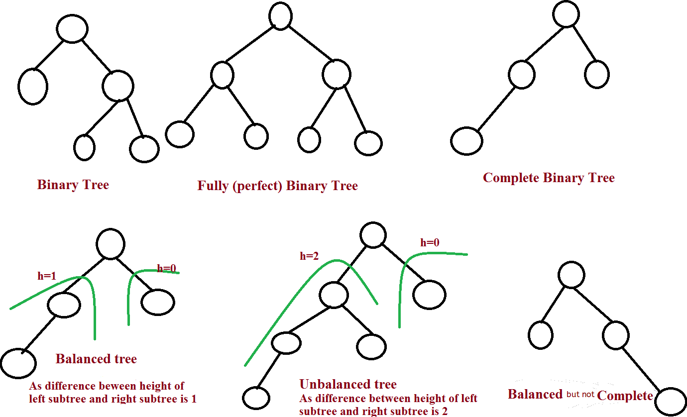

## P60

It has a "typo" -

What is the maximum number of nodes it can contain?

It should be 2^H - 1 instead of 2H - 1.

Also it takes long time to calculate large numbers.

```dos
For a height-balanced binary tree of height 50, the number of nodes are between -1408458270 and 2147483646.
Elapsed:	70 seconds
For a height-balanced binary tree with 50 nodes, the hight is between 6 and 7.
Elapsed:	0 seconds
```

## P63

```
            1
      /           \
     2             3
   /   \         /   \
  4     5       6     7
 / \   / \     / \   / \
8   9 10 11   12 13 14 15
```

## P64 (unfinished)

case-to-case inheritance is prohibited

```dos
C:\Code\MyScala\99-Scala-Problems\src\binarytree64\Tree64.scala:105:12
case class PositionedNode has case ancestor binarytree64.Node, but case-to-case inheritance is prohibited. To overcome this limitation, use extractors to pattern match on non-leaf nodes.
case class PositionedNode[+T](override val value: T, override val left: Tree[T], override val right: Tree[T], x: Int, y: Int) extends Node[T](value, left, right) {
```

How inheritance can be achieved in case classes?

The answer is simple: Case Class can extend another Class, trait or Abstract Class.

But still have issues on this P.

Go back to it.

## Case Class

A Scala Case Class is like a regular class, except it is good for modeling immutable data. It also serves useful in pattern matching, such a class has a default apply() method which handles object construction. A scala case class also has all vals, which means they are immutable.

Since a Scala case class is immutable, we might sometimes need a copy to make changes in without changing the original. So, we now see how to create a shallow copy of it.

## Shallow copy vs deep copy

A deep copy is a copy to another object where any changes we make to it don't reflect in the original object.

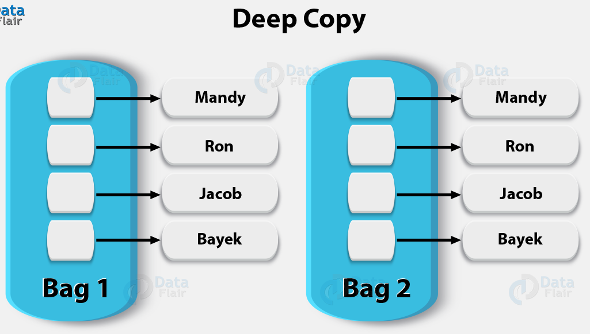

A shallow copy, however, is one where changes to the copy do reflect in the original.

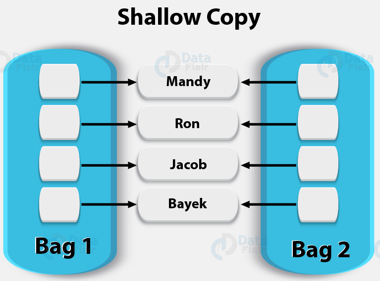

## P65, P66 (unfinished)

Same issue like P64

## Tree Traversals (Inorder, Preorder and Postorder)

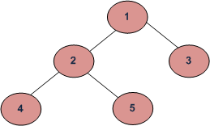

Depth First Traversals:

(a) Inorder (Left, Root, Right) : 4 2 5 1 3

(b) Preorder (Root, Left, Right) : 1 2 4 5 3

(c) Postorder (Left, Right, Root) : 4 5 2 3 1

Breadth-First or Level Order Traversal: 1 2 3 4 5

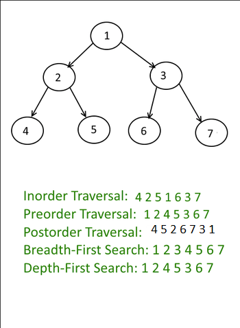

## P70B

Omitted; we can only create well-formed trees.

# P70C

The program takes long time to stop.

## ...
