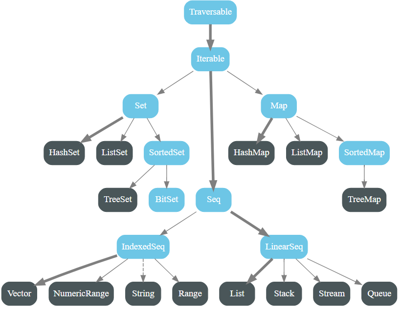

# MyScala

My Scala

## Scala 2 cheat sheet

https://docs.scala-lang.org/cheatsheets/index.html

## Misc

## Coming soon

- 99 Scala Problems

- REST API with Akka HTTP

- Play framework for REST API

- ScalaTest for test

- ScalaMock for mock

- Scalafix for lint

- ? for Scala DevOps

  Buddy CI/CD?

- ? for Scala ?

## Variance : Covariance vs Contravariance vs Invariance

方差：协方差 vs 逆变 vs 不变

```scala
class Foo[+A] // A covariant class
class Bar[-A] // A contravariant class
class Baz[A]  // An invariant class
```

https://docs.scala-lang.org/tour/variances.html


Variance is the correlation of subtyping relationships of complex types and the subtyping relationships of their component types. Scala supports variance annotations of type parameters of generic classes, to allow them to be covariant, contravariant, or invariant if no annotations are used.

Generic classes in Scala are invariant by default.

## 2022-01-05 Zhi

https://github.com/zhiwilliam/couses

## 2022-01-12 Zhi

DSL

-A +B

C D

type class ?

```scala
val map: Map[String, List[Int]] = Map("a" -> List(1, 2, 3), "b" -> List(2, 3))
  // type class
  //println(map.partition(x => x._2.length > 2))
  map.partitionByValue(_ <= 2)
  // (Map("a"-> List(1,2), "b" -> List(2)), Map("a"-> List(3), "b" -> List(3)))
```

```scala
val map: Map[A, List[B]]
```

Use span!

Case class doesn't have methods, so no need to be extended by case classes.

Type class doesn't have inheritance.

Rabbits don't meow, bark or speak.

cio schema

foldLeft +

foldLeft - ==> foldLeft +(-)

## 2022-01-19 Zhi

cio project vs Spring

"<%" ducking type

Structural types

"Object" keyword in Scala : singleton (pattern)

It uses the least memory




Grouping all impilicit objects in implicits ==> easy to import \*.implicits.\_

Quill

Syntax sugar for implicit

Course2, test.scala -> check it out

try to find out the best mutual funds (best increasements)

map + flatmap + pure

flatmap is sequential, not in parallel

flatmap: A->F[B]

need to get the values!

need to create a new box, can't use the old box

need to use Future API

In Scala, flatMap() method is identical to the map() method, but the only difference is that in flatMap the inner grouping of an item is removed and a sequence is generated. It can be defined as a blend of map method and flatten method.

map: A->B

blackbox

doesn't need to get the values!

Applicative

How to do flatmap in parallel?

Use cats library or Future

try and future are eager only, others are lazy

Context bound

Java HashMap

HashMap issues and solutions in Java 7

HashMap issues and solutions in Java 8

Ppl from Citi capital market and RBC are generally better

Core Java interview

- cache friendly

- non-blocking

Big Data interview

- Garbage collection

## 2022-02-02 Zhi

- iw q: context bound, Monad, map, flatmap, Functor, ...
- cats, kitter
- fs2, http4s
- co.fs2
- Functor, Foldable, Applicative
- CO ? ZIO (resource management, multi-threading, ...)
- Use play (future) before CO
- hoccon === JSON
- tsec authentication
- how to async?
- how to DI?
- how to work with Kafka?
- Spring Boot uses annotation for Redis - this has cons
- Fail fast for cloud / k8s infrastructure
- Fail propogate to the parent layer in the cloud / distributed environment
- Use CATS, ZIO to do async
- cache friendly : CPU cache, L1/L2/L3, padding
- Scala pathways: Big Data / data processing / Spark & Streaming, REST API, DSL, ...
- fifo queue
- Use Scala to build a project for the job interview
- SQL iw: Lin Ping lao shi's SQL - google search
- Java iw: Hashmap vs Hashtable, Bean Factory, aspect, design pattern, ...

## 2022-02-04 1st Scala job from the agent

- BOA Java/Scala developer!
    from the buddy agent Collbera

- Pluralsight free weekend!
    - 7 Scala courses and certificates

## 2022-02-07 1st Scala job talk with agent


## Scala Worksheet and Compiling Server issue and solution

Worksheet is a good feature.


However, it doesn't work with the JDK 17.

The issues are something like "Compiling Server has issues" blah blah blah ...

Changing JDK to 13 will solve this issue, even may have some warnings.


## 2022-02-09 Zhi

Kleisli

Stream for big data process

Tagless Final pattern in Scala
https://www.baeldung.com/scala/tagless-final-pattern#:~:text=In%20this%20long%20article%2C%20we,is%20available%20over%20on%20GitHub.
https://github.com/Baeldung/scala-tutorials/tree/master/scala-core-fp

IO.pure <-> ZIO.success

Read Tagless Final before learning CATS

ZIO and CATS are similar

Stream:
FS2 stream
spark stream
akka stream
...

scala shapeless

CATS OptionT

Monad transformer is the most difficult part in Monad

OptionT, ConT, IorT ... T is for Transformer

范畴论! category theory

h after g

丘奇数 / 邱奇数

Church number

CATS Effect! not cats


The Bay, Scotia, Citi, Meilin, HSBC, Disney, CIBC (tiger), ...


Questions


### Code practice tips

map, flatmap, groupBy

type class

context bound: memorize it


### Job Search tips

Make a story (find a path: I choose REST API)

Update CV

Talk to Mr. Zhi

Update LinkedIn

Iws

Offers


### Homework

Make a list of future to a future of list


