# MyScala

My Scala

## Scala 2 cheat sheet

<https://docs.scala-lang.org/cheatsheets/index.html>

## Variance : Covariance vs Contravariance vs Invariance

方差：协方差 vs 逆变 vs 不变

```scala
class Foo[+A] // A covariant class
class Bar[-A] // A contravariant class
class Baz[A]  // An invariant class
```

<https://docs.scala-lang.org/tour/variances.html>

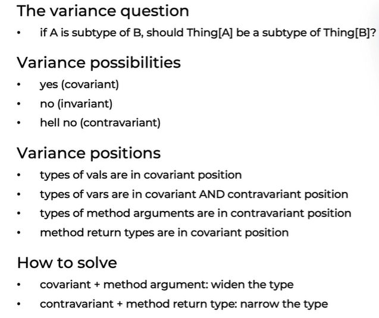

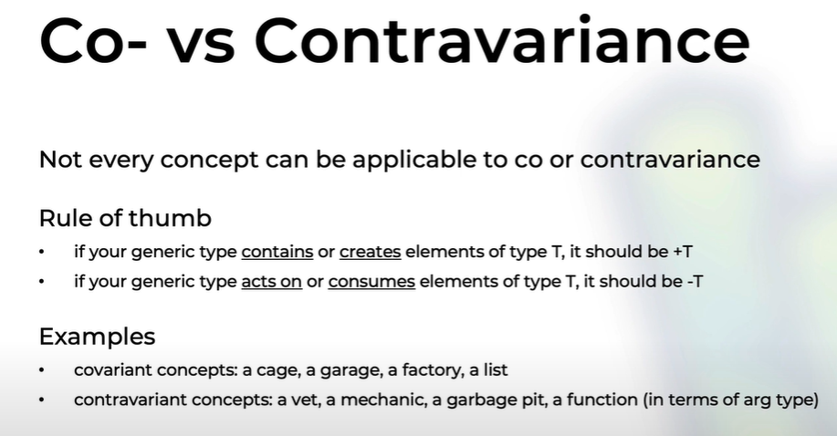

Variance is the correlation of subtyping relationships of complex types and the subtyping relationships of their component types. Scala supports variance annotations of type parameters of generic classes, to allow them to be covariant, contravariant, or invariant if no annotations are used.

Generic classes in Scala are invariant by default.

## Scala Worksheet and Compiling Server issue and solution

Worksheet is a good feature.

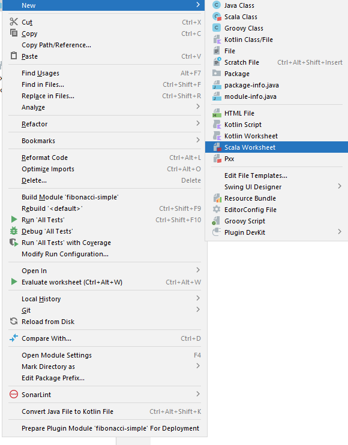

However, it doesn't work with the JDK 17.

The issues are something like "Compiling Server has issues" blah blah blah ...

Changing JDK to 13 will solve this issue, even may have some warnings.

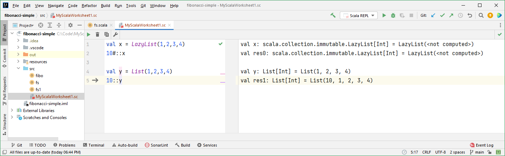

## 2022-02-12 re-create sbt project

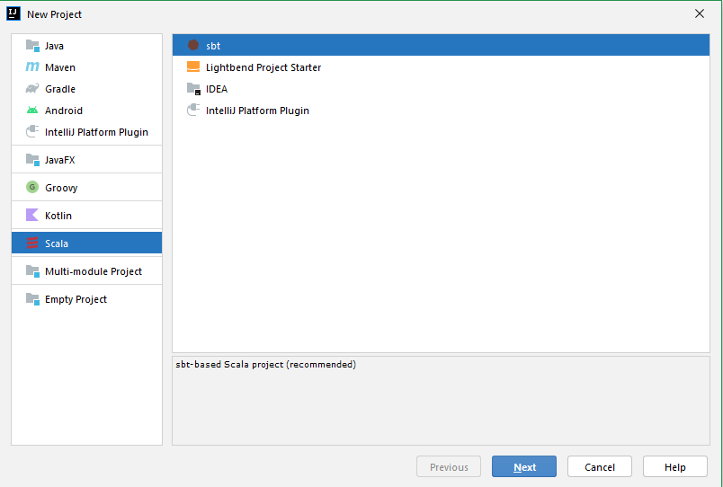

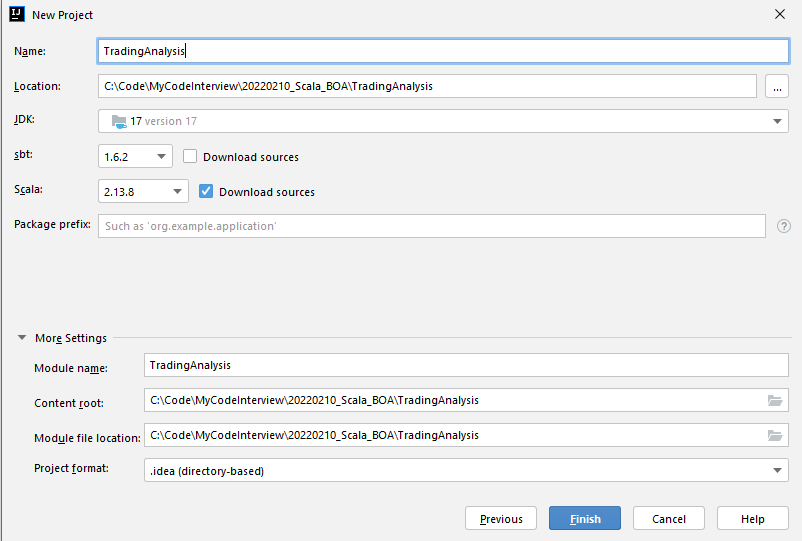

build.sbt

```dos
ThisBuild / version := "0.1.0-SNAPSHOT"

ThisBuild / scalaVersion := "2.13.8"

lazy val root = (project in file("."))
  .settings(
    name := "TradingAnalysis"
  )

libraryDependencies += "org.scalatest" %% "scalatest" % "3.2.11" % "test"
```

Update sbt

### Scala: Any, AnyVal, AnyRef

Type Hierarchies in Scala

<https://www.baeldung.com/scala/type-hierarchies#:~:text=2.2.-,AnyVal,are%20an%20abstract%20final%20type>.

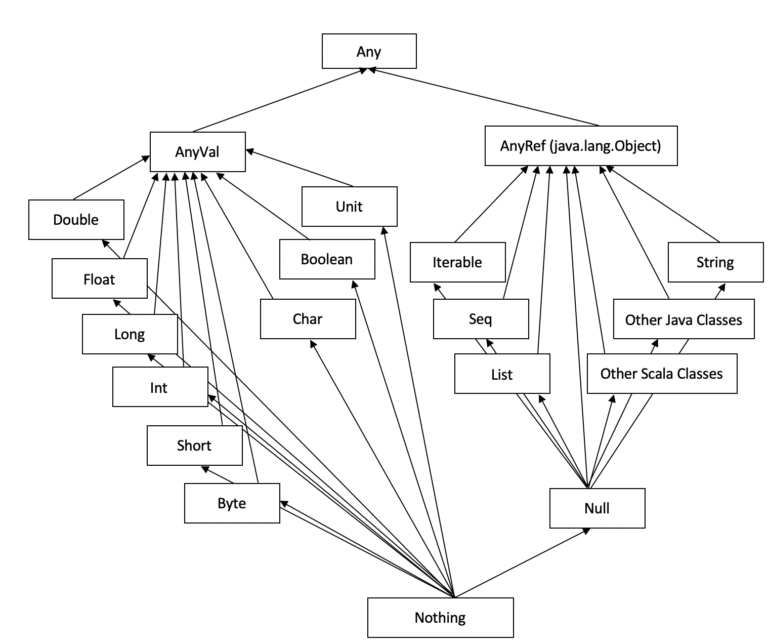

### Scala: Case class

Adding the case keyword causes the compiler to add a number of useful features automatically. The keyword suggests an association with case expressions in pattern matching.

First, the compiler automatically converts the constructor arguments into immutable fields (vals). The val keyword is optional. If you want mutable fields, use the var keyword. So, our constructor argument lists are now shorter.

Second, the compiler automatically implements equals, hashCode, and toString methods to the class, which use the fields specified as constructor arguments. So, we no longer need our own toString() methods.

Finally, also, the body of Person class becomes empty because there are no methods that we need to define!

### Scala: Type class

A type class is a pattern in programming originating in Haskell. It allows us to extend existing libraries with new functionality, without using traditional inheritance, and without altering the original library source code.

A type class is a group of types that satisfy a contract typically defined by a trait. They enable us to make a function more ad-hoc polymorphic without touching its code. This flexibility is the biggest win with the type-class pattern.

Type Classes in Scala

<https://www.baeldung.com/scala/type-classes>

### Scala: mkString

You can make use of the mkString( ) method to concatenate the resulting list

### Scala: WorkSheet

WorkSheet is very helpful.

### Scala: Monad

Monads in Scala

<https://www.baeldung.com/scala/monads>

In Scala, Monads is a construction which performs successive calculations. It is an object which covers the other object. It is worth noting that here, the output of an operation at some step is an input to another computations, which is a parent to the recent step of the program stated. Monad is neither a class nor a trait, it is a concept. The maximum collections of the Scala are Monads but not all the Monads are collections, there are several Monads which are containers like Options in Scala. In short, we can say that in Scala the data types that implements map as well as flatMap() like Options, Lists, etc. are called as Monads.

Collections that support map as well as flatMap are called as monadic.

Other Collections

Besides List, there are a number of other collections in the Scala standard library. The most commonly used of these are Map, Set, Vector, and Stream.

- Option
- List
- Map
- Set
- Vector
- Stream -> Lazy List

Why Vector?

Use of List is very common in Scala, but it can sometimes be inefficient for random access because the time complexity of accessing an element is O(n). Scala provides an alternative collection, Vector, that is optimized for random access by storing its elements in a tree structure that has little memory overhead. All operations on a Vector happen in effectively constant time, which means that for large collections it can be significantly more efficient than List.

A Stream is essentially a List with an undetermined number of elements, which are computed lazily. A “lazy” value is one that is only evaluated at the time it’s required.

### Scala: for-comprehension

for === flatMap

yield === map

A Comprehensive Guide to For-Comprehension in Scala

<https://www.baeldung.com/scala/for-comprehension>

In imperative programming languages, we use loops such as for-loop and while-loop to iterate over collections. The Scala programming language introduced a new kind of loop: the for-comprehension.

```scala
    val partyResultList = tradingDataList.groupBy(_.party).map {
      case (party, tradingList) =>
        val tradingVolume = tradingList.flatMap { rec =>
          rec.numShares.flatMap(shares => rec.tradePrice.map(price => price * BigDecimal(shares))).toList
        }.sum
        (party, tradingVolume)
    }.toList
```

==>

```scala
    val partyResultNewList = tradingDataList.groupBy(_.party).map {
      case (party, tradingList) =>
        val tradingVolume = {
          for {
            rec <- tradingList
            share <- rec.numShares
            price <- rec.tradePrice
          } yield BigDecimal(share) * price
      }.sum
      (party, tradingVolume)
    }.toList
```

Only Option, List, Vector ... are monad, String is not monad!

for === flatmap
yield === map

```scala
    val riskResultList = tradingDataList.groupBy(_.ticker).map {
      case (ticker, tradingList) =>
        val risk = tradingList.flatMap { rec =>
          rec.numShares.flatMap(shares => rec.tradePrice.map(price => price * BigDecimal(shares) * (if (rec.action.toLowerCase() == "buy") 1 else
            -1))).toList
        }.sum
        (ticker, risk)
    }.toList
```

==>

```scala
    val riskResultNewList = tradingDataList.groupBy(_.ticker).map {
      case (ticker, tradingList) =>
        val risk = {
          for {
            rec <- tradingList
            share <- rec.numShares
            price <- rec.tradePrice
          } yield BigDecimal(share) * price * (if (rec.action.toLowerCase == "buy") 1 else -1)
        }.sum
        (ticker, risk)
    }.toList
```

### Scala: ZIO Stream

ZStream
<https://zio.dev/next/datatypes/stream/zstream/>

ZIO Chunk is a wrapper on Java array.

Lots of good things in ZIO doc.

### Scala: Variance

Variance is the correlation of subtyping relationships of complex types and the subtyping relationships of their component types. Scala supports variance annotations of type parameters of generic classes, to allow them to be covariant, contravariant, or invariant if no annotations are used. The use of variance in the type system allows us to make intuitive connections between complex types, whereas the lack of variance can restrict the reuse of a class abstraction.

```scala
class Foo[+A] // A covariant class
class Bar[-A] // A contravariant class
class Baz[A]  // An invariant class
```

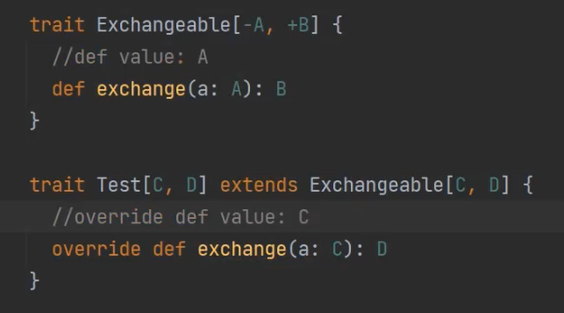

In this example,

- A has to be the child type of C (because of -A)
- B has to be the parent class of D (because of +B)

Type safe is the key!

The father of Scalar named his INC as TypeSafe

Why type safe?

Python is not type safe. Some issues happen only in runtime - can't be identitied in compile-time.

### Scala: CATS

Scala – Introduction to Cats
<https://www.baeldung.com/scala/cats-intro>

<https://github.com/typelevel/cats>

```scala
libraryDependencies += "org.typelevel" %% "cats-core" % "2.2.0"
```

A type class is a pattern in programming originating in Haskell. It allows us to extend existing libraries with new functionality, without using traditional inheritance, and without altering the original library source code.

In Scala Cats, components of type classes can be specified as:

- Type class
- Instances of type class
- Interface objects
- Interface syntax

### Scala: Pure

What is pure in Scala?

A function is called pure function if it always returns the same result for same argument values and it has no side effects like modifying an argument (or global variable) or outputting something

Examples of pure functions

Given that definition of pure functions, as you might imagine, methods like these in the scala.math.\_ package are pure functions:

- abs
- ceil
- max
- min

These Scala String methods are also pure functions:

- isEmpty
- length
- substring

Examples of impure functions

- foreach

- Date and time related methods like getDayOfWeek, getHour, and getMinute are all impure because their output depends on something other than their input parameters.

## Scala: CATS

```dos
libraryDependencies += "org.typelevel" %% "cats-core" % "2.3.0"
```

```scala
import cats.implicits._

import scala.language.reflectiveCalls

val map1: scala.collection.immutable.Map[Int,List[String]] = Map(1 -> List(a), 2 -> List(b))
val map2: scala.collection.immutable.Map[Int,List[String]] = Map(1 -> List(c), 2 -> List(d))
val res0: scala.collection.immutable.Map[Int,List[String]] = Map(1 -> List(a, c), 2 -> List(b, d))
```

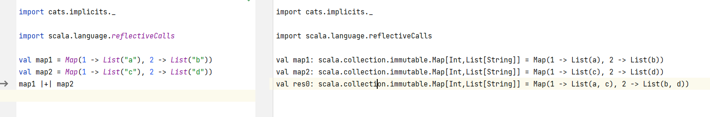

## 2022-02-19

### reduceOption

When reducing a collection to a single value, prefer reduceOption to reduce.

ome collections are empty, using reduce may throw an exception.

`java.lang.UnsupportedOperationException: empty.reduceLeft`

reduceOption is a safer alternative, since it encodes the possibility of the empty list in its return type:

```dos
Seq(1, 2, 3).reduceOption(_ + _)
// res0: Option[Int] = Some(6)

Seq.empty[Int].reduceOption(_ + _)
// res1: Option[Int] = None
```

### Scalaz

Scalaz is a Scala library for functional programming.

```dos
libraryDependencies += "org.scalaz" %% "scalaz-core" % "7.3.0-SNAPSHOT"
```

Scalaz provides additional modules for functionality beyond the basics included in scalaz-core

scalaz-effect: Effectful programs

```dos
libraryDependencies += "org.scalaz" %% "scalaz-effect" % "7.3.0-SNAPSHOT"
```

Community

- Gitter: Gitter
- IRC: Freenode
- Mailing List: Google Groups
- Voice Chat: Discord

### Cats Effect

The pure asynchronous runtime for Scala

Cats Effect is a high-performance, asynchronous, composable framework for building real-world applications in a purely functional style within the Typelevel ecosystem.

It provides a concrete tool, known as "the IO monad", for capturing and controlling actions, often referred to as "effects", that your program wishes to perform within a resource-safe, typed context with seamless support for concurrency and coordination.

These effects may be asynchronous (callback-driven) or synchronous (directly returning values); they may return within microseconds or run infinitely.

Even more importantly, Cats Effect defines a set of typeclasses which define what it means to be a purely functional runtime system. These abstractions power a thriving ecosystem consisting of streaming frameworks, JDBC database layers, HTTP servers and clients, asynchronous clients for systems like Redis and MongoDB, and so much more! Additionally, you can leverage these abstractions within your own application to unlock powerful capabilities with little-or-no code changes, for example solving problems such as dependency injection, multiple error channels, shared state across modules, tracing, and more.

## Scala with Cats Book

Learn the key type classes of: Functor, Monoid, Applicative, and Monad

### sbt (aka scala build tool)

sbt is an open-source build tool for Scala and Java projects, similar to Apache's Maven and Ant.

### Lightbend (<- Typesafe)

Lightbend, formerly known as Typesafe, is a company founded by Martin Odersky, the creator of the Scala programming language, Jonas Bonér, the creator of the Akka middleware, and Paul Phillips in 2011.

### Flash scope vs Session scope

The Flash scope works exactly like the Session, but with one difference:

- data are kept for only one request

### Scala Web MVC & REST : Play framework (built on Akka)

Play is based on a lightweight, stateless, web-friendly architecture.

Built on Akka, Play provides predictable and minimal resource consumption (CPU, memory, threads) for highly-scalable applications.

Play Framework is an open-source web application framework which follows the model–view–controller (MVC) architectural pattern.

- Stateless: Play 2 is fully RESTful – there is no Java EE session per connection.
- Integrated unit testing: JUnit and Selenium support is included in the core.
- API comes with most required elements built-in.
- Asynchronous I/O: due to using Akka HTTP as its web server, Play can service long requests asynchronously rather than tying up HTTP threads doing business logic like Java EE frameworks that don't use the asynchronous support offered by Servlet 3.0.[20]
- Modular architecture: like Ruby on Rails and Django, Play comes with the concept of modules.
  Native Scala support: Play 2 uses Scala internally but also exposes both a Scala API, and a Java API that is deliberately slightly different to fit in with Java conventions, and - Play is completely interoperable with Java.

Play provides integration with test frameworks for unit testing and functional testing for both Scala and Java applications. For Scala, integrations with Scalatest and Specs2 are provided out-of-the-box and, for Java, there is integration with JUnit 4. For both languages, there is also integration with Selenium (software). SBT is used to run the tests and also to generate reports. It is also possible to use code coverage tools by using sbt plugins such as scoverage or jacoco4sbt.

As a full-stack framework, Play includes all the components you need to build Web Applications and REST services, such as an integrated HTTP server, form handling, Cross-Site Request Forgery (CSRF) protection, a powerful routing mechanism, I18n support, and more.

Play's lightweight, stateless, web-friendly architecture uses Akka and Akka Streams under the covers to provide predictable and minimal resource consumption (CPU, memory, threads). Thanks to its reactive model, applications scale naturally–both horizontally and vertically.

Play is non-opinionated about database access, and integrates with many object relational mapping (ORM) layers. It supports Anorm, Slick, and JPA out of the box, but many customers use NoSQL or other ORMs.

```
[info] !!!!!!!!!!!!!!!!!!!!!!!!!!!!!!!!!!!!!!!!!!!!!!!!!!!
[info]   Java version is 17. Play supports only 8 and 11.
[info] !!!!!!!!!!!!!!!!!!!!!!!!!!!!!!!!!!!!!!!!!!!!!!!!!!!
```

Play uses HOCON as its configuration file format. HOCON has a number of advantages over other config formats, but there are two things that can be used when modifying settings.

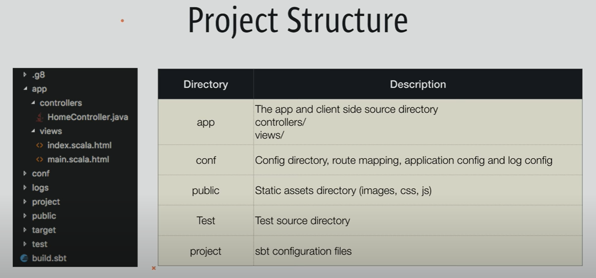

### Scala & Akka HTTP

akkahttp

Akka HTTP Client API

### Akka HTTP & JSON: Integrating Spray, Circe and Jackson with Akka HTTP, with Scala

- None (without anything of these 3 supports)

- Spray

- Circe

A JSON library for Scala powered by Cats

- Jackson

## 2022-02-20

Building a REST API in Scala with Play Framework

```dos
C:\Code\MyScala>sbt new playframework/play-scala-seed.g8
[info] welcome to sbt 1.5.8 (Oracle Corporation Java 11.0.12)
[info] loading global plugins from C:\Users\...\.sbt\1.0\plugins
[info] set current project to new (in build file:/C:/Users/.../AppData/Local/Temp/sbt_2708936f/new/)

This template generates a Play Scala project

name [play-scala-seed]: scala-rest-play-simple
organization [com.example]: com.sutek
play_version [2.8.13]:
scala_version [2.13.8]:

Template applied in C:\Code\MyScala\.\scala-rest-play-simple

C:\Code\MyScala>cd scala-rest-play-simple

C:\Code\MyScala\scala-rest-play-simple>sbt run
[info] [launcher] getting org.scala-sbt sbt 1.5.2  (this may take some time)...
[info] [launcher] getting Scala 2.12.13 (for sbt)...
[info] welcome to sbt 1.5.2 (Oracle Corporation Java 11.0.12)
[info] loading global plugins from C:\Users\...\.sbt\1.0\plugins
[info] loading settings for project scala-rest-play-simple-build from plugins.sbt ...
[info] loading project definition from C:\Code\MyScala\scala-rest-play-simple\project
[info] loading settings for project root from build.sbt ...
[info]   __              __
[info]   \ \     ____   / /____ _ __  __
[info]    \ \   / __ \ / // __ `// / / /
[info]    / /  / /_/ // // /_/ // /_/ /
[info]   /_/  / .___//_/ \__,_/ \__, /
[info]       /_/               /____/
[info]
[info] Version 2.8.13 running Java 11.0.12
[info]
[info] Play is run entirely by the community. If you want to keep using it please consider donating:
[info] https://www.playframework.com/sponsors
[info]

--- (Running the application, auto-reloading is enabled) ---

[info] p.c.s.AkkaHttpServer - Listening for HTTP on /0:0:0:0:0:0:0:0:9000

(Server started, use Enter to stop and go back to the console...)

[info] compiling 7 Scala sources and 1 Java source to C:\Code\MyScala\scala-rest-play-simple\target\scala-2.13\classes ...
[info] Non-compiled module 'compiler-bridge_2.13' for Scala 2.13.8. Compiling...
[info]   Compilation completed in 10.387s.
WARNING: An illegal reflective access operation has occurred
WARNING: Illegal reflective access by com.google.inject.internal.cglib.core.$ReflectUtils$1 (file:/C:/Users/x239757/AppData/Local/Coursier/Cache/v1/https/repo1.maven.org/maven2/com/google/inject/guice/4.2.3/guice-4.2.3.jar) to method java.lang.ClassLoader.defineClass(java.lang.String,byte[],int,int,java.security.ProtectionDomain)
WARNING: Please consider reporting this to the maintainers of com.google.inject.internal.cglib.core.$ReflectUtils$1
WARNING: Use --illegal-access=warn to enable warnings of further illegal reflective access operations
WARNING: All illegal access operations will be denied in a future release
2022-02-20 08:07:38 INFO  play.api.http.EnabledFilters  Enabled Filters (see <https://www.playframework.com/documentation/latest/Filters>):

    play.filters.csrf.CSRFFilter
    play.filters.headers.SecurityHeadersFilter
    play.filters.hosts.AllowedHostsFilter

2022-02-20 08:07:38 INFO  play.api.Play  Application started (Dev) (no global state)
2022-02-20 08:07:38 WARN  p.api.mvc.DefaultJWTCookieDataCodec  decode: cookie has invalid signature! message = JWT signature does not match locally computed signature. JWT validity cannot be asserted and should not be trusted.
2022-02-20 08:07:38 INFO  p.api.mvc.DefaultJWTCookieDataCodec  The JWT signature in the cookie does not match the locally computed signature with the server. This usually indicates the browser has a leftover cookie from another Play application, so clearing cookies may resolve this error message.
2022-02-20 08:07:38 WARN  p.api.mvc.DefaultJWTCookieDataCodec  decode: cookie has invalid signature! message = JWT signature does not match locally computed signature. JWT validity cannot be asserted and should not be trusted.
2022-02-20 08:07:38 INFO  p.api.mvc.DefaultJWTCookieDataCodec  The JWT signature in the cookie does not match the locally computed signature with the server. This usually indicates the browser has a leftover cookie from another Play application, so clearing cookies may resolve this error message.
2022-02-20 08:07:38 WARN  p.api.mvc.DefaultJWTCookieDataCodec  decode: cookie has invalid signature! message = JWT signature does not match locally computed signature. JWT validity cannot be asserted and should not be trusted.
2022-02-20 08:07:38 INFO  p.api.mvc.DefaultJWTCookieDataCodec  The JWT signature in the cookie does not match the locally computed signature with the server. This usually indicates the browser has a leftover cookie from another Play application, so clearing cookies may resolve this error message.
```

```
http://localhost:9000
```


Open the folder in IntelliJ.

Change the JDK to v11.

As we don’t need them, let’s remove HomeController.scala, index.scala.html, and main.scala.html files. Let’s also remove the existing content of the routes file.

```
@Singleton
@Inject
```

```dos
Json.format
BaseController
ControllerComponents
NoContent
OK
Accepted
NotFound
Created
BadRequest
```

How to add a config in IJ instead of run the command?

```dos
sbt run
```

Once it starts, it will automatically "refresh" itself with your code changes - but in the lazy way :-)

```
curl localhost:9000/api/v1/todo
curl localhost:9000/api/v1/todo/1
curl -v -d '{"description": "some new item"}' -H 'Content-Type: application/json' -X POST localhost:9000/api/v1/todo
curl -X PUT localhost:9000/api/v1/todo/done/1
curl -X PATCH localhost:9000/api/v1/todo/done/1
curl -X DELETE localhost:9000/api/v1/todo/done
curl -X DELETE localhost:9000/api/v1/todo/888
```


### GitBook

<https://app.gitbook.com/home>

### Scala.js

Looks like it is still worse than Angular and React.

Scala.js + Play ? Use Angular, React instead?

```
addSbtPlugin("org.scala-js" % "sbt-scalajs" % "1.9.0")
```

## 2022-02-21

### Book: Scala With Cats

```
scalaVersion := "2.13.1"
libraryDependencies +=
"org.typelevel" %% "cats-core" % "2.1.0"
scalacOptions ++= Seq(
"-Xfatal-warnings"
)
```

```
sbt new scalawithcats/cats-seed.g8
```

```
sbt new typelevel/sbt-catalysts.g8
```

Output:

```dos
C:\Code\MyScala>sbt new scalawithcats/cats-seed.g8
[info] welcome to sbt 1.5.8 (Oracle Corporation Java 11.0.12)
[info] loading global plugins from C:\Users\...\.sbt\1.0\plugins
[info] set current project to new (in build file:/C:/Users/.../AppData/Local/Temp/sbt_b0150015/new/)
name [Cats Sandbox]: scala-cats-simple
author [Anonymous Aardvark]: Brian Su
package [sandbox]: com.sutek.scala.cats.sandbox

Template applied in C:\Code\MyScala\.\scala-cats-simple
```

```
C:\Code\MyScala>sbt new typelevel/sbt-catalysts.g8
[info] welcome to sbt 1.5.8 (Oracle Corporation Java 11.0.12)
[info] loading global plugins from C:\Users\...\.sbt\1.0\plugins
[info] set current project to new (in build file:/C:/Users/.../AppData/Local/Temp/sbt_34d893c1/new/)
name [aProjectName]: scala-cats-catalysts
sbt_catalysts_version [0.24]:
sbt_version [1.2.8]:
publish_org [com.YourOrgName]: com.sutek
package [com.sutek]: com.sutek.scala.cats.catalysts
github_org [com.sutek]:
dev_name [your name]: Brian Su
dev_github_handler [yourhandler_without_@]: briansu2004
dev_email [yourEmail]: briansu2004@hotmail.com

Template applied in C:\Code\MyScala\.\scala-cats-catalysts
```

### Good explanations on Type Class (and Type Class instances, implicit) in Scala interview

Type classes are a programming pattern originating in Haskell. They allow us to extend existing libraries with new functionality, without using traditional inheritance, and without altering the original library source code.

A type class is an interface or API that represents some functionality we want to implement. In Scala a type class is represented by a trait with at least one type parameter. For example, we can represent generic “serialize to JSON” behaviour as follows:

```scala
// Define a very simple JSON AST
sealed trait Json
final case class JsObject(get: Map[String, Json]) extends Json
final case class JsString(get: String) extends Json
final case class JsNumber(get: Double) extends Json
final case object JsNull extends Json
// The "serialize to JSON" behaviour is encoded in this trait
trait JsonWriter[A] {
    def write(value: A): Json
}
```

JsonWriter is our type class in this example, with Json and its subtypes providing supporting code. When we come to implement instances of JsonWriter, the type parameter A will be the concrete type of data we are writing.

The instances of a type class provide implementations of the type class for specific types we care about, which can include types from the Scala standard library and types from our domain model.

In Scala we define instances by creating concrete implementations of the type class and tagging them with the implicit keyword:

```scala
final case class Person(name: String, email: String)

object JsonWriterInstances {
    implicit val stringWriter: JsonWriter[String] = new JsonWriter[String] {
        def write(value: String): Json = JsString(value)
    }

    implicit val personWriter: JsonWriter[Person] =
        new JsonWriter[Person] {
        def write(value: Person): Json =
            JsObject(Map(
            "name" -> JsString(value.name),
            "email" -> JsString(value.email)
            ))
        }

    // etc...
}
```

These are known as implicit values (?)

A type class use is any functionality that requires a type class instance to work. In Scala this means any method that accepts instances of the type class as implicit parameters.

Cats provides utilities that make type classes easier to use, and you will sometimes seem these patterns in other libraries. There are two ways it does this: Interface Objects and Interface Syntax.

The simplest way of creating an interface that uses a type class is to place methods in a singleton object:

```scala
object Json {
    def toJson[A](value: A)(implicit w: JsonWriter[A]): Json = w.write(value)
}
```

To use this object, we import any type class instances we care about and call the relevant method:

```scala
import JsonWriterInstances._
Json.toJson(Person("Dave", "dave@example.com"))
// res1: Json = JsObject(Map("name" -> JsString("Dave"), "email" -> JsString("dave@example.com")))
```

The compiler spots that we’ve called the toJson method without providing the implicit parameters. It tries to fix this by searching for type class instances of the relevant types and inserting them at the call site:

```scala
Json.toJson(Person("Dave", "dave@example.com"))(personWriter)
```

Interface Syntax

We can alternatively use extension methods to extend existing types with interface methods.

```scala
object JsonSyntax {
    implicit class JsonWriterOps[A](value: A) {
        def toJson(implicit w: JsonWriter[A]): Json = w.write(value)
    }
}
```

We use interface syntax by importing it alongside the instances for the types we need:

```scala
import JsonWriterInstances._
import JsonSyntax._
Person("Dave", "dave@example.com").toJson
// res3: Json = JsObject(Map("name" -> JsString("Dave"), "email" -> JsString("dave@example.com")))
```

Again, the compiler searches for candidates for the implicit parameters and fills them in for us:

```scala
Person("Dave", "dave@example.com").toJson(personWriter)
```

The implicitly Method

The Scala standard library provides a generic type class interface called

```scala
implicitly. Its definition is very simple:
def implicitly[A](implicit value: A): A = value
```

We can use implicitly to summon any value from implicit scope. We provide the type we want and implicitly does the rest:

```scala
import JsonWriterInstances._
implicitly[JsonWriter[String]]
// res5: JsonWriter[String] = repl.Session$App0$JsonWriterInstances$$anon$1@6fccdc48
```

```
Json.toJson("A string!")
```

The places where the compiler searches for candidate instances is known as the implicit scope. The implicit scope applies at the call site; that is the point where we call a method with an implicit parameter. The implicit scope which roughly consists of:

    - local or inherited definitions;
    - imported definitions;
    - definitions in the companion object of the type class or the parameter type (in this case JsonWriter or String).

Definitions are only included in implicit scope if they are tagged with the implicit keyword.

If the compiler sees multiple candidate definitions, it fails with an ambiguous implicit values error.

Recursive Implicit Resolution / type class composition

The power of type classes and implicits lies in the compiler’s ability to combine implicit definitions when searching for candidate instances.

```scala
implicit def optionWriter[A](implicit writer: JsonWriter[A]): JsonWriter[Option[A]] = new JsonWriter[Option[A]] {
    def write(option: Option[A]): Json =
        option match {
            case Some(aValue) => writer.write(aValue)
            case None => JsNull
        }
}
```

### sbt task failed, see log for details

IntelliJ -> Help -> Show Logs in Explorer -> C:\Users\...\AppData\Local\JetBrains\IdeaIC2021.3\log\idea.log

## 2022-02-23

### ZIO

<https://www.youtube.com/watch?v=6A1SA5Be9qw>

How to live coding with ZIO?

ZIO 1.x or 2.x?

### ZIO effect

ZIO vs ZIO effect

ZIO can convert both synchronous and asynchronous side-effects into ZIO effects (pure values). These functions can be used to wrap procedural code, allowing you to seamlessly use all features of ZIO with legacy Scala and Java code, as well as third-party libraries.

A Future can be converted into a ZIO effect using ZIO.fromFuture.

```
import scala.concurrent.Future

lazy val future = Future.successful("Hello!")

val zfuture: Task[String] =
  ZIO.fromFuture { implicit ec =>
    future.map(_ => "Goodbye!")
  }
```

### Monix

Monix is a high-performance Scala / Scala.js library for composing asynchronous, event-based programs.

### http4s

http4s + cats effect vs http4s + zio vs zio-http

Typeful, functional, streaming HTTP for Scala

### ZIO get started

<https://www.baeldung.com/scala/zio-intro>

## 2022-02-26

- ZIOStream

  ZIO versions in sbt is very important!

## 2022-02-27

- FS2

FS2 is a library for purely functional, effectful, and polymorphic stream processing library in the Scala programming language. Its design goals are compositionality, expressiveness, resource safety, and speed. The name is a modified acronym for Functional Streams for Scala (FSS, or FS2).

FS2 is available for Scala 2.12, Scala 2.13, Scala 3, and Scala.js. FS2 is built upon two major functional libraries for Scala, Cats, and Cats-Effect. Regardless of those dependencies, FS2 core types (streams and pulls) are polymorphic in the effect type (as long as it is compatible with cats-effect typeclasses), and thus FS2 can be used with other effect libraries, such as Monix.

- Check sbt version

```
sbt sbtVersion
```

```
C:\Code\MyScala>sbt sbtVersion
[info] welcome to sbt 1.5.8 (Oracle Corporation Java 11.0.12)
[info] loading global plugins from C:\Users\x239757\.sbt\1.0\plugins
[info] loading project definition from C:\Code\MyScala\project
[info] set current project to myscala (in build file:/C:/Code/MyScala/)
[info] 1.5.8
```

or

```
sbt about
```

```
C:\Code\MyScala>sbt about
[info] welcome to sbt 1.5.8 (Oracle Corporation Java 11.0.12)
[info] loading global plugins from C:\Users\x239757\.sbt\1.0\plugins
[info] loading project definition from C:\Code\MyScala\project
[info] set current project to myscala (in build file:/C:/Code/MyScala/)
[info] This is sbt 1.5.8
[info] The current project is ProjectRef(uri("file:/C:/Code/MyScala/"), "myscala") 0.1.0-SNAPSHOT
[info] The current project is built against Scala 2.12.14
[info] Available Plugins
[info]  - sbt.ScriptedPlugin
[info]  - sbt.plugins.CorePlugin
[info]  - sbt.plugins.Giter8TemplatePlugin
[info]  - sbt.plugins.IvyPlugin
[info]  - sbt.plugins.JUnitXmlReportPlugin
[info]  - sbt.plugins.JvmPlugin
[info]  - sbt.plugins.MiniDependencyTreePlugin
[info]  - sbt.plugins.SbtPlugin
[info]  - sbt.plugins.SemanticdbPlugin
[info] sbt, sbt plugins, and build definitions are using Scala 2.12.14
```

- How to check Scala version

```
scala -version
```

```
C:\Code\MyScala>scala -version
Scala code runner version 2.13.7 -- Copyright 2002-2021, LAMP/EPFL and Lightbend, Inc.
```

- VSCode Metals extension

<https://scalameta.org/metals/>

- VSCode Metals extension has many code samples:

i.e. ZIO HelloWorld

```
package zio.project.seed

import java.io.IOException

import zio.console._
import zio.{ App, ExitCode, URIO, ZIO }

object HelloWorld extends App {

  override def run(args: List[String]): URIO[Console, ExitCode] =
    myAppLogic.exitCode

  val myAppLogic: ZIO[Console, IOException, Unit] =
    for {
      _    <- putStrLn("Hello! What is your name?")
      name <- getStrLn
      _    <- putStrLn(s"Hello, $name, welcome to ZIO!")
    } yield ()
}
```

Akka

```
//#full-example
package com.example


import akka.actor.typed.ActorRef
import akka.actor.typed.ActorSystem
import akka.actor.typed.Behavior
import akka.actor.typed.scaladsl.Behaviors
import com.example.GreeterMain.SayHello

//#greeter-actor
object Greeter {
  final case class Greet(whom: String, replyTo: ActorRef[Greeted])
  final case class Greeted(whom: String, from: ActorRef[Greet])

  def apply(): Behavior[Greet] = Behaviors.receive { (context, message) =>
    context.log.info("Hello {}!", message.whom)
    //#greeter-send-messages
    message.replyTo ! Greeted(message.whom, context.self)
    //#greeter-send-messages
    Behaviors.same
  }
}
//#greeter-actor

//#greeter-bot
object GreeterBot {

  def apply(max: Int): Behavior[Greeter.Greeted] = {
    bot(0, max)
  }

  private def bot(greetingCounter: Int, max: Int): Behavior[Greeter.Greeted] =
    Behaviors.receive { (context, message) =>
      val n = greetingCounter + 1
      context.log.info("Greeting {} for {}", n, message.whom)
      if (n == max) {
        Behaviors.stopped
      } else {
        message.from ! Greeter.Greet(message.whom, context.self)
        bot(n, max)
      }
    }
}
//#greeter-bot

//#greeter-main
object GreeterMain {

  final case class SayHello(name: String)

  def apply(): Behavior[SayHello] =
    Behaviors.setup { context =>
      //#create-actors
      val greeter = context.spawn(Greeter(), "greeter")
      //#create-actors

      Behaviors.receiveMessage { message =>
        //#create-actors
        val replyTo = context.spawn(GreeterBot(max = 3), message.name)
        //#create-actors
        greeter ! Greeter.Greet(message.name, replyTo)
        Behaviors.same
      }
    }
}
//#greeter-main

//#main-class
object AkkaQuickstart extends App {
  //#actor-system
  val greeterMain: ActorSystem[GreeterMain.SayHello] = ActorSystem(GreeterMain(), "AkkaQuickStart")
  //#actor-system

  //#main-send-messages
  greeterMain ! SayHello("Charles")
  //#main-send-messages
}
//#main-class
//#full-example
```

akka sbt

```
name := "akka-quickstart-scala"

version := "1.0"

scalaVersion := "2.13.1"

lazy val akkaVersion = "2.6.18"

// Run in a separate JVM, to make sure sbt waits until all threads have
// finished before returning.
// If you want to keep the application running while executing other
// sbt tasks, consider https://github.com/spray/sbt-revolver/
fork := true

libraryDependencies ++= Seq(
  "com.typesafe.akka" %% "akka-actor-typed" % akkaVersion,
  "ch.qos.logback" % "logback-classic" % "1.2.3",
  "com.typesafe.akka" %% "akka-actor-testkit-typed" % akkaVersion % Test,
  "org.scalatest" %% "scalatest" % "3.1.0" % Test
)
```

Scalatest

```
object CubeCalculator extends App {
  def cube(x: Int) = {
    x * x * x
  }
}
```

```
class CubeCalculatorTest extends org.scalatest.funsuite.AnyFunSuite {
  test("CubeCalculator.cube") {
    assert(CubeCalculator.cube(3) === 27)
  }
}
```

Scalatest sbt

```
lazy val root = (project in file(".")).
  settings(
    inThisBuild(List(
      organization := "com.example",
      scalaVersion := "2.13.6"
    )),
    name := "scalatest-example"
  )

libraryDependencies += "org.scalatest" %% "scalatest" % "3.2.9" % Test
```

- Gitpod

<https://www.gitpod.io/>

With Gitpod, you spin up fresh, automated dev environments for each task, in the cloud, in seconds.

- Develop a new feature? Start a new workspace.
- Review a pull request? Start a new workspace.
- Fix a bug in production? Start a new workspace.

<https://scalameta-gitpodg8-fs2wfv9whm9.ws-us34.gitpod.io/>

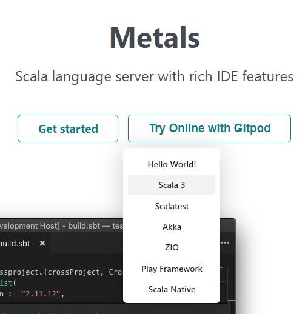

Tried to Open workspace from GitPod to VSCode Desktop but failed:

```
[2/27/2022, 9:37:19 AM] open workspace window: vscode://gitpod.gitpod-desktop/workspace/gitpod-g8?%7B%22instanceId%22%3A%226e307514-280f-4181-9db0-19f72a0124a1%22%2C%22workspaceId%22%3A%22scalameta-gitpodg8-0ofi28oq54a%22%2C%22gitpodHost%22%3A%22https%3A%2F%2Fgitpod.io%22%7D
[2/27/2022, 9:37:19 AM] acquiring lock: gitpod.io
[2/27/2022, 9:37:19 AM] acquired lock: gitpod.io
[2/27/2022, 9:37:19 AM] fetching the local app from https://gitpod.io/static/bin/gitpod-local-companion-windows.exe
[2/27/2022, 9:37:20 AM] installing the local app to C:\Users\x239757\AppData\Local\Temp\gitpod-local-companion-3164-ontl4MraTZ5U-.exe
[2/27/2022, 9:37:21 AM] installing the local app: {
  "path": "C:\\Users\\x239757\\AppData\\Local\\Temp\\gitpod-local-companion-3164-ontl4MraTZ5U-.exe",
  "etag": "\"r7tmgnae6f4\""
}
[2/27/2022, 9:37:22 AM] starting the local app with the config: {
  "gitpodHost": "https://gitpod.io",
  "configFile": "file:///c%3A/Users/x239757/AppData/Local/Temp/gitpod_ssh_config-3164-BDKCN6tP09sT",
  "apiPort": 62798
}
[2/27/2022, 9:37:22 AM] failed to start the local app: Error: spawn EBUSY
[2/27/2022, 9:37:22 AM] released lock: gitpod.io
[2/27/2022, 9:37:22 AM] failed to open uri: Error: spawn EBUSY
```

## 2022-05-16

Because of Oracle Java license issues, we need to replace with OpenJDK.

Looks like Scala 2/3 can work with OpenJDK 18.

Here are some tricks:

SDK

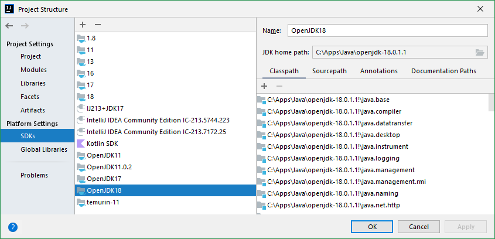

Project SDK setting

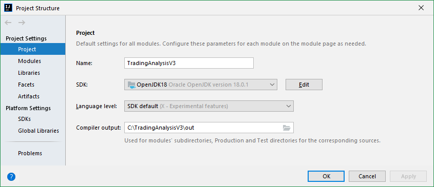

"project reload" checkbox in "sbt settings..."

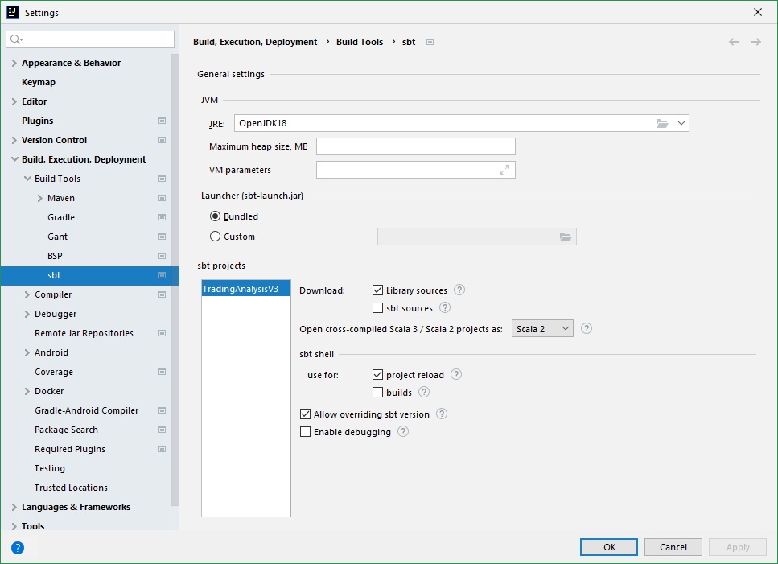

Run/Debug configurations

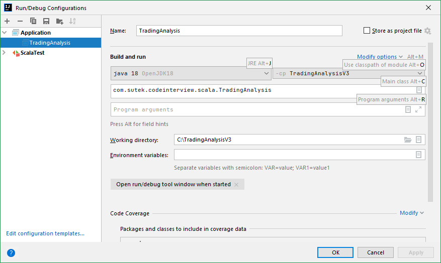

Remove <user_home>/.sbt folder to let it rebuild!

## 2022-05-17

Looks like it still has issues on creating a new Scala sbt project with OpenJDK 18.

Switch to Java 18 and no issues.

### Trick - PrintWriter

```scala
val printWriter = new PrintWriter(System.out);
```

### Trick - "Redirect input from"

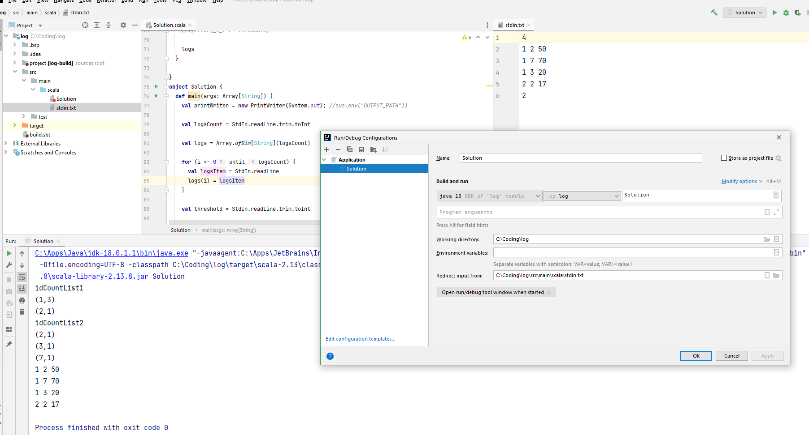

## 2022-12-09

IJ works with Microsoft Open JDK 17

Add SDK - C:\Program Files\Microsoft\jdk-17.0.3.7-hotspot
