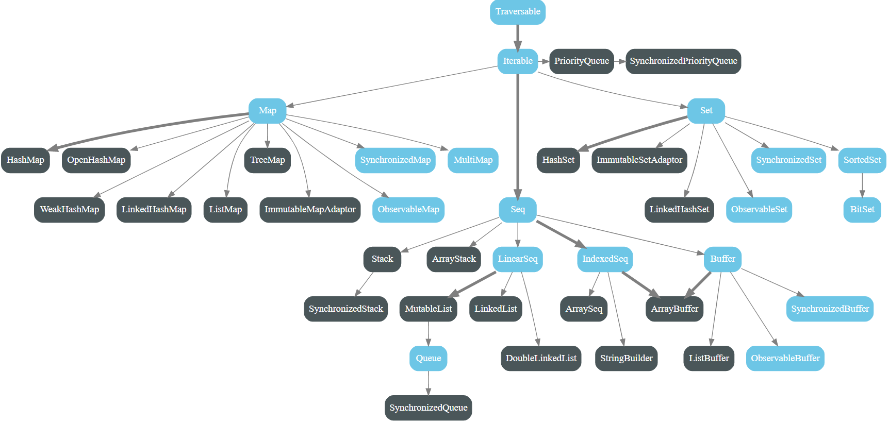

# MyScala

My Scala

## Scala 2 cheat sheet

https://docs.scala-lang.org/cheatsheets/index.html

## Coming soon

- 99 Scala Problems

- REST API with Akka HTTP

- Play framework for REST API

- ScalaTest for test

- ScalaMock for mock

- Scalafix for lint

- ? for Scala DevOps

  Buddy CI/CD?

- ? for Scala ?

## Variance : Covariance vs Contravariance vs Invariance

方差：协方差 vs 逆变 vs 不变

```scala
class Foo[+A] // A covariant class
class Bar[-A] // A contravariant class
class Baz[A]  // An invariant class
```

https://docs.scala-lang.org/tour/variances.html


Variance is the correlation of subtyping relationships of complex types and the subtyping relationships of their component types. Scala supports variance annotations of type parameters of generic classes, to allow them to be covariant, contravariant, or invariant if no annotations are used.

Generic classes in Scala are invariant by default.

## 2022-01-05 Zhi

https://github.com/zhiwilliam/couses

## 2022-01-12 Zhi

DSL

-A +B

C D

type class ?

```scala
val map: Map[String, List[Int]] = Map("a" -> List(1, 2, 3), "b" -> List(2, 3))
  // type class
  //println(map.partition(x => x._2.length > 2))
  map.partitionByValue(_ <= 2)
  // (Map("a"-> List(1,2), "b" -> List(2)), Map("a"-> List(3), "b" -> List(3)))
```

```scala
val map: Map[A, List[B]]
```

Use span!

Case class doesn't have methods, so no need to be extended by case classes.

Type class doesn't have inheritance.

Rabbits don't meow, bark or speak.

cio schema

foldLeft +

foldLeft - ==> foldLeft +(-)

## 2022-01-19 Zhi

cio project vs Spring

"<%" ducking type

Structural types

"Object" keyword in Scala : singleton (pattern)

It uses the least memory




Grouping all impilicit objects in implicits ==> easy to import \*.implicits.\_

Quill

Syntax sugar for implicit

Course2, test.scala -> check it out

try to find out the best mutual funds (best increasements)

map + flatmap + pure

flatmap is sequential, not in parallel

flatmap: A->F[B]

need to get the values!

need to create a new box, can't use the old box

need to use Future API

In Scala, flatMap() method is identical to the map() method, but the only difference is that in flatMap the inner grouping of an item is removed and a sequence is generated. It can be defined as a blend of map method and flatten method.

map: A->B

blackbox

doesn't need to get the values!

Applicative

How to do flatmap in parallel?

Use cats library or Future

try and future are eager only, others are lazy

Context bound

Java HashMap

HashMap issues and solutions in Java 7

HashMap issues and solutions in Java 8

Ppl from Citi capital market and RBC are generally better

Core Java interview

- cache friendly

- non-blocking

Big Data interview

- Garbage collection

## 2022-02-02 Zhi

- iw q: context bound, Monad, map, flatmap, Functor, ...
- cats, kitter
- fs2, http4s
- co.fs2
- Functor, Foldable, Applicative
- CO ? ZIO (resource management, multi-threading, ...)
- Use play (future) before CO
- hoccon === JSON
- tsec authentication
- how to async?
- how to DI?
- how to work with Kafka?
- Spring Boot uses annotation for Redis - this has cons
- Fail fast for cloud / k8s infrastructure
- Fail propogate to the parent layer in the cloud / distributed environment
- Use CATS, ZIO to do async
- cache friendly : CPU cache, L1/L2/L3, padding
- Scala pathways: Big Data / data processing / Spark & Streaming, REST API, DSL, ...
- fifo queue
- Use Scala to build a project for the job interview
- SQL iw: Lin Ping lao shi's SQL - google search
- Java iw: Hashmap vs Hashtable, Bean Factory, aspect, design pattern, ...

## 2022-02-04 1st Scala job from the agent

- BOA Java/Scala developer!
    from the buddy agent Collbera

- Pluralsight free weekend!
    - 7 Scala courses and certificates

## 2022-02-07 1st Scala job talk with agent


## Scala Worksheet and Compiling Server issue and solution

Worksheet is a good feature.


However, it doesn't work with the JDK 17.

The issues are something like "Compiling Server has issues" blah blah blah ...

Changing JDK to 13 will solve this issue, even may have some warnings.


## 2022-02-09 Zhi

Kleisli

Stream for big data process

Tagless Final pattern in Scala
https://www.baeldung.com/scala/tagless-final-pattern#:~:text=In%20this%20long%20article%2C%20we,is%20available%20over%20on%20GitHub.
https://github.com/Baeldung/scala-tutorials/tree/master/scala-core-fp

IO.pure <-> ZIO.success

Read Tagless Final before learning CATS

ZIO and CATS are similar

Stream:
FS2 stream
spark stream
akka stream
...

scala shapeless

CATS OptionT

Monad transformer is the most difficult part in Monad

OptionT, ConT, IorT ... T is for Transformer

范畴论! category theory

h after g

丘奇数 / 邱奇数

Church number

CATS Effect! not cats


The Bay, Scotia, Citi, Meilin, HSBC, Disney, CIBC (tiger), ...


Questions


### Code practice tips

map, flatmap, groupBy

type class

context bound: memorize it


### Job Search tips

Make a story (find a path: I choose REST API)

Update CV

Talk to Mr. Zhi

Update LinkedIn

Iws

Offers


### Homework

Make a list of future to a future of list


Answer:

```scala
import scala.concurrent.Future

object ListOfFuture2FutureOfList extends App {

  import scala.concurrent.ExecutionContext.Implicits.global

  val ListOfFuture = List(Future(1), Future(2), Future(3))
  val futureOfList = Future.sequence(ListOfFuture)
  println(futureOfList)
}
```


## 2022-02-10 BOA iw

REST API, microservices, Big Data, ZIO

3-yr contract

15 ppl team (2 BA, 1 PM, 7 dev, some offshore devs); the whole team is quite large 

## 2022-02-12 re-create sbt project


build.sbt

```dos
ThisBuild / version := "0.1.0-SNAPSHOT"

ThisBuild / scalaVersion := "2.13.8"

lazy val root = (project in file("."))
  .settings(
    name := "TradingAnalysis"
  )

libraryDependencies += "org.scalatest" %% "scalatest" % "3.2.11" % "test"
```

Update sbt

## 2022-02-13

### Move files in IJ

Be careful to move files in IJ

Always use refactor to move, or you will break things.


### Scala: Any, AnyVal, AnyRef

Type Hierarchies in Scala

https://www.baeldung.com/scala/type-hierarchies#:~:text=2.2.-,AnyVal,are%20an%20abstract%20final%20type.


### Scala: Case class

Adding the case keyword causes the compiler to add a number of useful features automatically. The keyword suggests an association with case expressions in pattern matching.

First, the compiler automatically converts the constructor arguments into immutable fields (vals). The val keyword is optional. If you want mutable fields, use the var keyword. So, our constructor argument lists are now shorter.

Second, the compiler automatically implements equals, hashCode, and toString methods to the class, which use the fields specified as constructor arguments. So, we no longer need our own toString() methods.

Finally, also, the body of Person class becomes empty because there are no methods that we need to define!

### Scala: Type class

A type class is a pattern in programming originating in Haskell. It allows us to extend existing libraries with new functionality, without using traditional inheritance, and without altering the original library source code.

A type class is a group of types that satisfy a contract typically defined by a trait. They enable us to make a function more ad-hoc polymorphic without touching its code. This flexibility is the biggest win with the type-class pattern.

Type Classes in Scala

https://www.baeldung.com/scala/type-classes


### Scala: mkString

You can make use of the mkString( ) method to concatenate the resulting list 


### Scala: WorkSheet

WorkSheet is very helpful.


### Scala: Monad

Monads in Scala

https://www.baeldung.com/scala/monads


In Scala, Monads is a construction which performs successive calculations. It is an object which covers the other object. It is worth noting that here, the output of an operation at some step is an input to another computations, which is a parent to the recent step of the program stated. Monad is neither a class nor a trait, it is a concept. The maximum collections of the Scala are Monads but not all the Monads are collections, there are several Monads which are containers like Options in Scala. In short, we can say that in Scala the data types that implements map as well as flatMap() like Options, Lists, etc. are called as Monads.

Collections that support map as well as flatMap are called as monadic.


Other Collections

Besides List, there are a number of other collections in the Scala standard library. The most commonly used of these are Map, Set, Vector, and Stream. 

- Option
- List
- Map
- Set
- Vector
- Stream -> Lazy List


Why Vector?

Use of List is very common in Scala, but it can sometimes be inefficient for random access because the time complexity of accessing an element is O(n). Scala provides an alternative collection, Vector, that is optimized for random access by storing its elements in a tree structure that has little memory overhead. All operations on a Vector happen in effectively constant time, which means that for large collections it can be significantly more efficient than List.


A Stream is essentially a List with an undetermined number of elements, which are computed lazily. A “lazy” value is one that is only evaluated at the time it’s required.


### Scala: for-comprehension

for === flatMap

yield === map


A Comprehensive Guide to For-Comprehension in Scala

https://www.baeldung.com/scala/for-comprehension

In imperative programming languages, we use loops such as for-loop and while-loop to iterate over collections. The Scala programming language introduced a new kind of loop: the for-comprehension.


```scala
    val partyResultList = tradingDataList.groupBy(_.party).map {
      case (party, tradingList) =>
        val tradingVolume = tradingList.flatMap { rec =>
          rec.numShares.flatMap(shares => rec.tradePrice.map(price => price * BigDecimal(shares))).toList
        }.sum
        (party, tradingVolume)
    }.toList
```

==>

```scala
    val partyResultNewList = tradingDataList.groupBy(_.party).map {
      case (party, tradingList) =>
        val tradingVolume = {
          for {
            rec <- tradingList
            share <- rec.numShares
            price <- rec.tradePrice
          } yield BigDecimal(share) * price
      }.sum
      (party, tradingVolume)
    }.toList
```

Only Option, List, Vector ... are monad, String is not monad!

for === flatmap
yield === map

```scala
    val riskResultList = tradingDataList.groupBy(_.ticker).map {
      case (ticker, tradingList) =>
        val risk = tradingList.flatMap { rec =>
          rec.numShares.flatMap(shares => rec.tradePrice.map(price => price * BigDecimal(shares) * (if (rec.action.toLowerCase() == "buy") 1 else
            -1))).toList
        }.sum
        (ticker, risk)
    }.toList
```

==>

```scala
    val riskResultNewList = tradingDataList.groupBy(_.ticker).map {
      case (ticker, tradingList) =>
        val risk = {
          for {
            rec <- tradingList
            share <- rec.numShares
            price <- rec.tradePrice
          } yield BigDecimal(share) * price * (if (rec.action.toLowerCase == "buy") 1 else -1)
        }.sum
        (ticker, risk)
    }.toList
```

### Scala: ZIO Stream

ZStream
https://zio.dev/next/datatypes/stream/zstream/

ZIO Chunk is a wrapper on Java array.

Lots of good things in ZIO doc.

### Scala: Variance

Variance is the correlation of subtyping relationships of complex types and the subtyping relationships of their component types. Scala supports variance annotations of type parameters of generic classes, to allow them to be covariant, contravariant, or invariant if no annotations are used. The use of variance in the type system allows us to make intuitive connections between complex types, whereas the lack of variance can restrict the reuse of a class abstraction.

```scala
class Foo[+A] // A covariant class
class Bar[-A] // A contravariant class
class Baz[A]  // An invariant class
```


In this example, 

- A has to be the child type of C  (because of -A)
- B has to be the parent class of D (because of +B)

Type safe is the key!

The father of Scalar named his INC as TypeSafe

Why type safe?

Python is not type safe. Some issues happen only in runtime - can't be identitied in compile-time.


### Scala: CATS


Scala – Introduction to Cats
https://www.baeldung.com/scala/cats-intro

https://github.com/typelevel/cats

```scala
libraryDependencies += "org.typelevel" %% "cats-core" % "2.2.0"
```


A type class is a pattern in programming originating in Haskell. It allows us to extend existing libraries with new functionality, without using traditional inheritance, and without altering the original library source code. 

In Scala Cats, components of type classes can be specified as:

- Type class
- Instances of type class
- Interface objects
- Interface syntax

### Scala: Pure

What is pure in Scala?

A function is called pure function if it always returns the same result for same argument values and it has no side effects like modifying an argument (or global variable) or outputting something


Examples of pure functions

Given that definition of pure functions, as you might imagine, methods like these in the scala.math._ package are pure functions:

- abs
- ceil
- max
- min

These Scala String methods are also pure functions:

- isEmpty
- length
- substring


Examples of impure functions


- foreach

- Date and time related methods like getDayOfWeek, getHour, and getMinute are all impure because their output depends on something other than their input parameters. 


## 2022-02-14 BOA iw 2nd

The overall review is that your code is good! The end result (as discussed) is less important than the code quality.

We'll ask you a bunch of questions pertaining to Scala, Java and your experiences on different projects and such. Taking the lead on the interview will be my lead developers (Sean and Leo) – and there will be a behavioral interview section as well.

Failed!


## Scala: CATS

```dos
libraryDependencies += "org.typelevel" %% "cats-core" % "2.3.0"
```

```scala
import cats.implicits._

import scala.language.reflectiveCalls

val map1: scala.collection.immutable.Map[Int,List[String]] = Map(1 -> List(a), 2 -> List(b))
val map2: scala.collection.immutable.Map[Int,List[String]] = Map(1 -> List(c), 2 -> List(d))
val res0: scala.collection.immutable.Map[Int,List[String]] = Map(1 -> List(a, c), 2 -> List(b, d))
```


## Misc

### Self-cultivation


## ? Questions to StackOverflow

### Scala for-comprehension

Why this line doesn't work?

```scala
    val riskResultNewList = tradingDataList.groupBy(_.ticker).map {
      case (ticker, tradingList) =>
        val risk = tradingList.flatMap { rec =>
          for {
            inOut <- (if (rec.action.toLowerCase == "buy") 1 else -1)            // this line has error!
            share <- rec.numShares
            price <- rec.tradePrice
          } yield BigDecimal(share) * price //* (if (rec.action.toLowerCase == "buy") 1 else -1)
        }.sum
        (ticker, risk)
    }.toList
```


### Does Python have fo-comprehension?

### Does JavaScript have fo-comprehension?


## Questions to ask on Zhi's new class 2022-02-16 

- Why ZIO examples: 
    for { _ <- ... }

- What do ZIO projects look like?
    - ZIO + Kafka?

- What is the knowledge point for the Future List interview question?
    - sequence


##  2022-02-16 Zhi

BOA iw q

## 2022-02-17

BOA iw q V2

## 2022-02-18

- BOA iw q V3

- How to sum two Option[Int] in scala

    - Solution 1: CATS / monoid
  
```dos
import cats.implicits._

a |+| b
```

    - Solution 2: map and flatmap / for comprehension 


    - Soltion 3: reduceOption
    
    
    - Not a good solution: function

```dos
def addOptionInt(a: Option[Int], b: Option[Int]): Option[Int] = {
  (a, b) match {
    case(None, None) => None
    case(None, v@Some(_)) => v
    case(v@Some(_), None) => v
    case(Some(v1), Some(v2)) => Some(v1 + v2)
  }
}
```

    - Not a Soltion: getOrElse / orElse

```
a.getOrElse(0) + b.getOrElse(0)
```


    - Combination

```
import cats.implicits._

def addOptionInt(a: Option[Int], b: Option[Int]): Option[Int] = {
  (a, b) match {
    case (None, None) => None
    case (None, v@Some(_)) => v
    case (v@Some(_), None) => v
    case (Some(v1), Some(v2)) => Some(v1 + v2)
  }
}

def output(a: Option[Int], b: Option[Int]): Unit = {
  println(s"a: $a; b: $b")
  //println(s"for (x <- a; y <- b) yield x + y = ${for (x <- a; y <- b) yield x + y}")
  println(s"for (x <- a.orElse(Some(0)); y <- b.orElse(Some(0))) yield x + y = ${for (x <- a.orElse(Some(0)); y <- b.orElse(Some(0))) yield x + y}")
  println(s"a.flatMap(x => b.map(x + _)) = ${a.flatMap(x => b.map(x + _))}")
  println(s"(a ++ b).reduceOption(_ + _) = ${(a ++ b).reduceOption(_ + _)}")
  println(s"a |+| b = ${a |+| b}")
  println(s"addOptionInt(a,b) = ${addOptionInt(a, b)}")
  //println(s"a.getOrElse(0) + b.getOrElse(0) = ${a.getOrElse(0) + b.getOrElse(0)}")
}


var a: Option[Int] = None
var b: Option[Int] = None
output(a, b)

a = Some(1)
output(a, b)

b = Some(2)
output(a, b)

a = None
output(a, b)
```


Looks like 

a |+| b

and

(a ++ b).reduceOption(_ + _) 

are best answers.


## 2022-02-19

### reduceOption

When reducing a collection to a single value, prefer reduceOption to reduce.

ome collections are empty, using reduce may throw an exception.

`java.lang.UnsupportedOperationException: empty.reduceLeft`

reduceOption is a safer alternative, since it encodes the possibility of the empty list in its return type:

```dos
Seq(1, 2, 3).reduceOption(_ + _)
// res0: Option[Int] = Some(6)

Seq.empty[Int].reduceOption(_ + _)
// res1: Option[Int] = None
```

### Scalaz

Scalaz is a Scala library for functional programming.

```dos
libraryDependencies += "org.scalaz" %% "scalaz-core" % "7.3.0-SNAPSHOT"
```

Scalaz provides additional modules for functionality beyond the basics included in scalaz-core

scalaz-effect: Effectful programs

```dos
libraryDependencies += "org.scalaz" %% "scalaz-effect" % "7.3.0-SNAPSHOT"
```

Community
- Gitter: Gitter
- IRC: Freenode
- Mailing List: Google Groups
- Voice Chat: Discord


### Cats Effect

The pure asynchronous runtime for Scala

Cats Effect is a high-performance, asynchronous, composable framework for building real-world applications in a purely functional style within the Typelevel ecosystem. 

It provides a concrete tool, known as "the IO monad", for capturing and controlling actions, often referred to as "effects", that your program wishes to perform within a resource-safe, typed context with seamless support for concurrency and coordination. 

These effects may be asynchronous (callback-driven) or synchronous (directly returning values); they may return within microseconds or run infinitely.

Even more importantly, Cats Effect defines a set of typeclasses which define what it means to be a purely functional runtime system. These abstractions power a thriving ecosystem consisting of streaming frameworks, JDBC database layers, HTTP servers and clients, asynchronous clients for systems like Redis and MongoDB, and so much more! Additionally, you can leverage these abstractions within your own application to unlock powerful capabilities with little-or-no code changes, for example solving problems such as dependency injection, multiple error channels, shared state across modules, tracing, and more.

## Scala with Cats Book

Learn the key type classes of: Functor, Monoid, Applicative, and Monad


### sbt (aka scala build tool)

sbt is an open-source build tool for Scala and Java projects, similar to Apache's Maven and Ant.


### Lightbend (<- Typesafe)

Lightbend, formerly known as Typesafe, is a company founded by Martin Odersky, the creator of the Scala programming language, Jonas Bonér, the creator of the Akka middleware, and Paul Phillips in 2011.


### Flash scope vs Session scope

The Flash scope works exactly like the Session, but with one difference:

- data are kept for only one request


### Scala Web MVC & REST : Play framework (built on Akka)

Play is based on a lightweight, stateless, web-friendly architecture.

Built on Akka, Play provides predictable and minimal resource consumption (CPU, memory, threads) for highly-scalable applications.

Play Framework is an open-source web application framework which follows the model–view–controller (MVC) architectural pattern.


- Stateless: Play 2 is fully RESTful – there is no Java EE session per connection.
- Integrated unit testing: JUnit and Selenium support is included in the core.
- API comes with most required elements built-in.
- Asynchronous I/O: due to using Akka HTTP as its web server, Play can service long requests asynchronously rather than tying up HTTP threads doing business logic like Java EE frameworks that don't use the asynchronous support offered by Servlet 3.0.[20]
- Modular architecture: like Ruby on Rails and Django, Play comes with the concept of modules.
Native Scala support: Play 2 uses Scala internally but also exposes both a Scala API, and a Java API that is deliberately slightly different to fit in with Java conventions, and - Play is completely interoperable with Java.

Play provides integration with test frameworks for unit testing and functional testing for both Scala and Java applications. For Scala, integrations with Scalatest and Specs2 are provided out-of-the-box and, for Java, there is integration with JUnit 4. For both languages, there is also integration with Selenium (software). SBT is used to run the tests and also to generate reports. It is also possible to use code coverage tools by using sbt plugins such as scoverage or jacoco4sbt.

As a full-stack framework, Play includes all the components you need to build Web Applications and REST services, such as an integrated HTTP server, form handling, Cross-Site Request Forgery (CSRF) protection, a powerful routing mechanism, I18n support, and more. 

Play's lightweight, stateless, web-friendly architecture uses Akka and Akka Streams under the covers to provide predictable and minimal resource consumption (CPU, memory, threads). Thanks to its reactive model, applications scale naturally–both horizontally and vertically.

Play is non-opinionated about database access, and integrates with many object relational mapping (ORM) layers. It supports Anorm, Slick, and JPA out of the box, but many customers use NoSQL or other ORMs.

```
[info] !!!!!!!!!!!!!!!!!!!!!!!!!!!!!!!!!!!!!!!!!!!!!!!!!!!
[info]   Java version is 17. Play supports only 8 and 11.
[info] !!!!!!!!!!!!!!!!!!!!!!!!!!!!!!!!!!!!!!!!!!!!!!!!!!!
```


Play uses HOCON as its configuration file format.  HOCON has a number of advantages over other config formats, but there are two things that can be used when modifying settings.


### Scala & Akka HTTP 

akkahttp

Akka HTTP Client API


### Akka HTTP & JSON: Integrating Spray, Circe and Jackson with Akka HTTP, with Scala

- None (without anything of these 3 supports)

- Spray


- Circe

A JSON library for Scala powered by Cats


- Jackson

## 2022-02-20


Building a REST API in Scala with Play Framework

```dos
C:\Code\MyScala>sbt new playframework/play-scala-seed.g8
[info] welcome to sbt 1.5.8 (Oracle Corporation Java 11.0.12)
[info] loading global plugins from C:\Users\...\.sbt\1.0\plugins
[info] set current project to new (in build file:/C:/Users/.../AppData/Local/Temp/sbt_2708936f/new/)

This template generates a Play Scala project 

name [play-scala-seed]: scala-rest-play-simple
organization [com.example]: com.sutek
play_version [2.8.13]: 
scala_version [2.13.8]: 

Template applied in C:\Code\MyScala\.\scala-rest-play-simple

C:\Code\MyScala>cd scala-rest-play-simple

C:\Code\MyScala\scala-rest-play-simple>sbt run
[info] [launcher] getting org.scala-sbt sbt 1.5.2  (this may take some time)...
[info] [launcher] getting Scala 2.12.13 (for sbt)...
[info] welcome to sbt 1.5.2 (Oracle Corporation Java 11.0.12)
[info] loading global plugins from C:\Users\...\.sbt\1.0\plugins
[info] loading settings for project scala-rest-play-simple-build from plugins.sbt ...
[info] loading project definition from C:\Code\MyScala\scala-rest-play-simple\project
[info] loading settings for project root from build.sbt ...
[info]   __              __
[info]   \ \     ____   / /____ _ __  __
[info]    \ \   / __ \ / // __ `// / / /
[info]    / /  / /_/ // // /_/ // /_/ /
[info]   /_/  / .___//_/ \__,_/ \__, /
[info]       /_/               /____/
[info]
[info] Version 2.8.13 running Java 11.0.12
[info]
[info] Play is run entirely by the community. If you want to keep using it please consider donating:
[info] https://www.playframework.com/sponsors
[info]

--- (Running the application, auto-reloading is enabled) ---

[info] p.c.s.AkkaHttpServer - Listening for HTTP on /0:0:0:0:0:0:0:0:9000

(Server started, use Enter to stop and go back to the console...)

[info] compiling 7 Scala sources and 1 Java source to C:\Code\MyScala\scala-rest-play-simple\target\scala-2.13\classes ...
[info] Non-compiled module 'compiler-bridge_2.13' for Scala 2.13.8. Compiling...
[info]   Compilation completed in 10.387s.
WARNING: An illegal reflective access operation has occurred
WARNING: Illegal reflective access by com.google.inject.internal.cglib.core.$ReflectUtils$1 (file:/C:/Users/x239757/AppData/Local/Coursier/Cache/v1/https/repo1.maven.org/maven2/com/google/inject/guice/4.2.3/guice-4.2.3.jar) to method java.lang.ClassLoader.defineClass(java.lang.String,byte[],int,int,java.security.ProtectionDomain)
WARNING: Please consider reporting this to the maintainers of com.google.inject.internal.cglib.core.$ReflectUtils$1
WARNING: Use --illegal-access=warn to enable warnings of further illegal reflective access operations
WARNING: All illegal access operations will be denied in a future release
2022-02-20 08:07:38 INFO  play.api.http.EnabledFilters  Enabled Filters (see <https://www.playframework.com/documentation/latest/Filters>):

    play.filters.csrf.CSRFFilter
    play.filters.headers.SecurityHeadersFilter
    play.filters.hosts.AllowedHostsFilter

2022-02-20 08:07:38 INFO  play.api.Play  Application started (Dev) (no global state)
2022-02-20 08:07:38 WARN  p.api.mvc.DefaultJWTCookieDataCodec  decode: cookie has invalid signature! message = JWT signature does not match locally computed signature. JWT validity cannot be asserted and should not be trusted.
2022-02-20 08:07:38 INFO  p.api.mvc.DefaultJWTCookieDataCodec  The JWT signature in the cookie does not match the locally computed signature with the server. This usually indicates the browser has a leftover cookie from another Play application, so clearing cookies may resolve this error message.
2022-02-20 08:07:38 WARN  p.api.mvc.DefaultJWTCookieDataCodec  decode: cookie has invalid signature! message = JWT signature does not match locally computed signature. JWT validity cannot be asserted and should not be trusted.
2022-02-20 08:07:38 INFO  p.api.mvc.DefaultJWTCookieDataCodec  The JWT signature in the cookie does not match the locally computed signature with the server. This usually indicates the browser has a leftover cookie from another Play application, so clearing cookies may resolve this error message.
2022-02-20 08:07:38 WARN  p.api.mvc.DefaultJWTCookieDataCodec  decode: cookie has invalid signature! message = JWT signature does not match locally computed signature. JWT validity cannot be asserted and should not be trusted.
2022-02-20 08:07:38 INFO  p.api.mvc.DefaultJWTCookieDataCodec  The JWT signature in the cookie does not match the locally computed signature with the server. This usually indicates the browser has a leftover cookie from another Play application, so clearing cookies may resolve this error message.
```

```
http://localhost:9000
```


Open the folder in IntelliJ.

Change the JDK to v11.

As we don’t need them, let’s remove HomeController.scala, index.scala.html, and main.scala.html files. Let’s also remove the existing content of the routes file.

```
@Singleton
@Inject
```

```dos
Json.format
BaseController
ControllerComponents
NoContent
OK
Accepted
NotFound
Created
BadRequest
```


How to add a config in IJ instead of run the command?

```dos
sbt run
```

Once it starts, it will automatically "refresh" itself with your code changes - but in the lazy way :-)


```
curl localhost:9000/api/v1/todo
curl localhost:9000/api/v1/todo/1
curl -v -d '{"description": "some new item"}' -H 'Content-Type: application/json' -X POST localhost:9000/api/v1/todo
curl -X PUT localhost:9000/api/v1/todo/done/1
curl -X PATCH localhost:9000/api/v1/todo/done/1
curl -X DELETE localhost:9000/api/v1/todo/done
curl -X DELETE localhost:9000/api/v1/todo/888
```


### GitBook

https://app.gitbook.com/home


### Scala.js

Looks like it is still worse than Angular and React.

Scala.js + Play ? Use Angular, React instead?


```
addSbtPlugin("org.scala-js" % "sbt-scalajs" % "1.9.0")
```


## 2022-02-21

Book: Scala With Cats


```
scalaVersion := "2.13.1"
libraryDependencies +=
"org.typelevel" %% "cats-core" % "2.1.0"
scalacOptions ++= Seq(
"-Xfatal-warnings"
)
```

```
sbt new scalawithcats/cats-seed.g8
```


```
sbt new typelevel/sbt-catalysts.g8
```


Output:

```dos
C:\Code\MyScala>sbt new scalawithcats/cats-seed.g8
[info] welcome to sbt 1.5.8 (Oracle Corporation Java 11.0.12)
[info] loading global plugins from C:\Users\...\.sbt\1.0\plugins
[info] set current project to new (in build file:/C:/Users/.../AppData/Local/Temp/sbt_b0150015/new/)
name [Cats Sandbox]: scala-cats-simple
author [Anonymous Aardvark]: Brian Su
package [sandbox]: com.sutek.scala.cats.sandbox

Template applied in C:\Code\MyScala\.\scala-cats-simple
```

```
C:\Code\MyScala>sbt new typelevel/sbt-catalysts.g8
[info] welcome to sbt 1.5.8 (Oracle Corporation Java 11.0.12)
[info] loading global plugins from C:\Users\...\.sbt\1.0\plugins
[info] set current project to new (in build file:/C:/Users/.../AppData/Local/Temp/sbt_34d893c1/new/)
name [aProjectName]: scala-cats-catalysts
sbt_catalysts_version [0.24]: 
sbt_version [1.2.8]: 
publish_org [com.YourOrgName]: com.sutek 
package [com.sutek]: com.sutek.scala.cats.catalysts
github_org [com.sutek]: 
dev_name [your name]: Brian Su
dev_github_handler [yourhandler_without_@]: briansu2004
dev_email [yourEmail]: briansu2004@hotmail.com

Template applied in C:\Code\MyScala\.\scala-cats-catalysts
```


## Scala CV

### Samples


Good experience in writing Spark applications using Python and Scala.

Used Scala sbt to develop Scala coded spark projects and executed using spark-submit

Involved in developing a linear regression model to predict a continuous measurement for improving the observation on wind turbine data developed using spark with Scala API.

Used Spark and Spark-SQL to read the parquet data and create the tables in hive using the Scala API.

Implemented Spark using Scala and Spark SQL for faster testing and processing of data.

Implemented Spark using Scala and utilizing Data frames and Spark SQL API for faster processing of data.

Experienced in working with spark eco system using Spark SQL and Scala queries on different formats like Text file, CSV file.

Expertized in implementing Spark using Scala and Spark SQL for faster testing and processing of data responsible to manage data from different sources.

Proven experience in building in Data Driven applications using a combination of Java/Scala and the Spark framework

Typesafe Reactive Platform (Scala, Akka, and Play)

Scala.js

Full Stack Scala with the Play Framework and Scala.js

Udash is a Scala.js framework for building beautiful and maintainable web applications.


### Keywords

Functional programming

DSL

- Akka
- Finagle
- Spark
- Scalding
- Play
- Lift
- Scalatra
- Scalaz
- Cats
- ScalaTest
- Specs2


### Solution


REST - ?
Web MVC - play, Akka
Unit test - ScalaTest
Lib - Scalaz, CATS
Big Data - Spark (Spark Streaming, SparkQL, Spark Optimization, Spark performance tuning)
Config format - HOCON
Async / Reactive - Future, Promise
Framework - ZIO, play, Akka (Akka Typed, Akka Streams, Akka HTTP, Akka Classic Persistence, Akka Classic Clustering, Akka Classic Serialization)


### Stories

???


## To be forked


https://github.com/ochrons/scalajs-spa-tutorial

https://github.com/Filemon279/play-scalajs-universal

https://github.com/sherpal/Scala-Google-Spreadsheets

https://github.com/UdashFramework/

