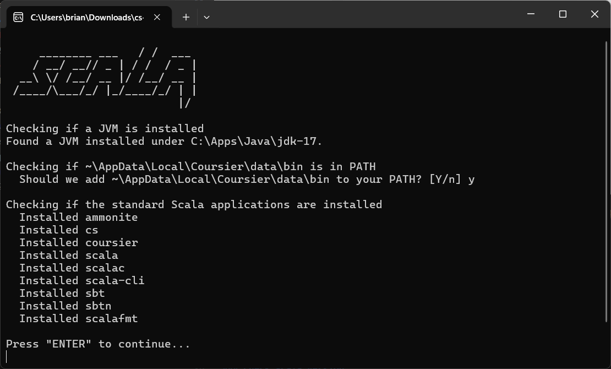
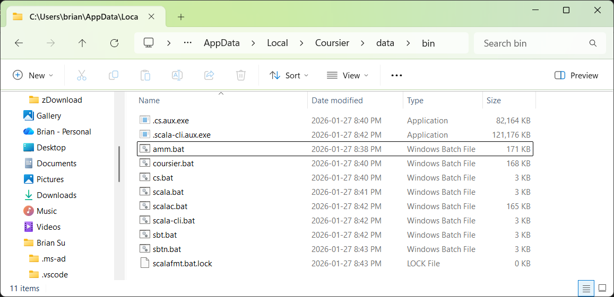
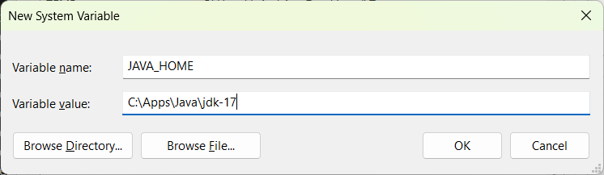
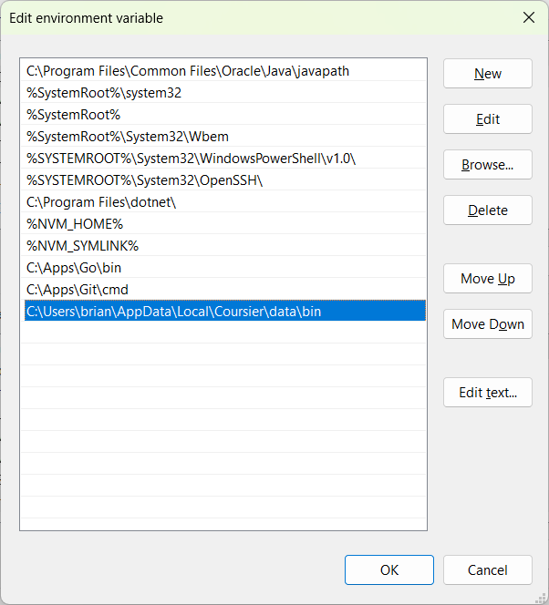
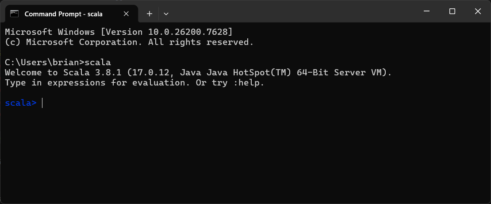
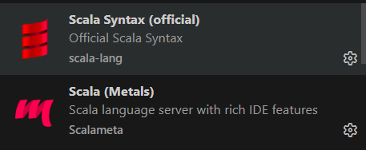
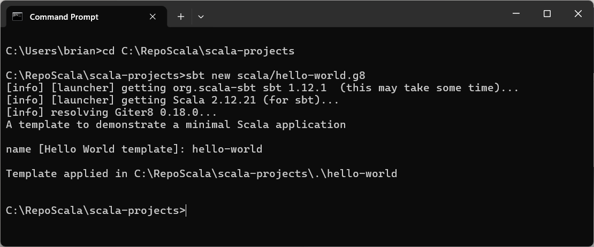
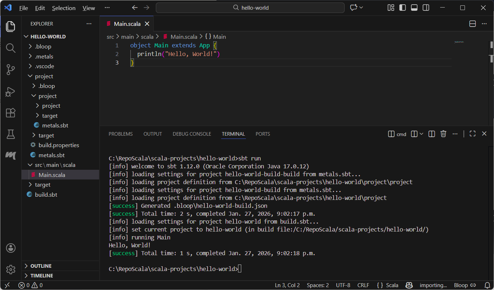
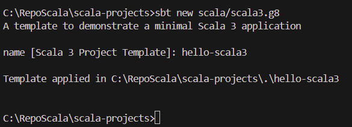
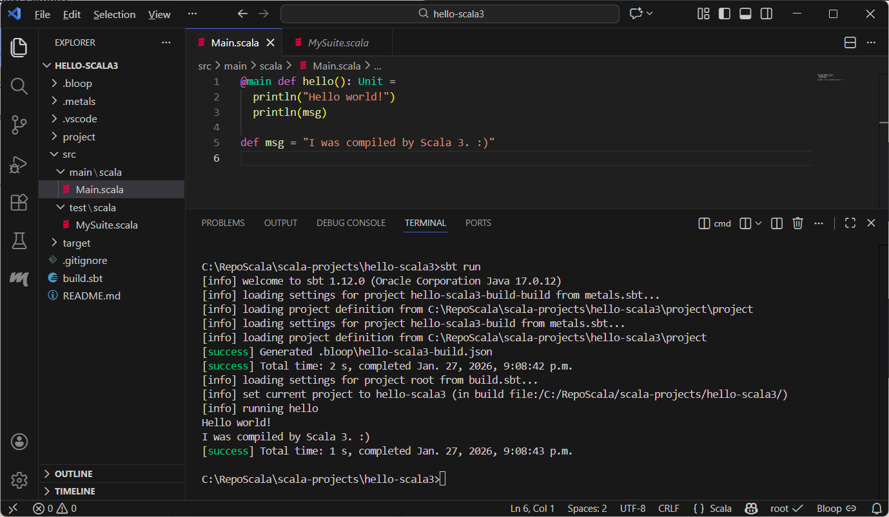

# How to use VSCode to code Scala in Windows

- [Steps](#steps)
  - [Download and Install Java 17](#download-and-install-java-17)
  - [Install Scala with cs setup (recommended)](#install-scala-with-cs-setup-recommended)
  - [Update Environment Variables](#update-environment-variables)
    - [Set Java\_HOME](#set-java_home)
    - [Edit Path](#edit-path)
  - [Check Scala Version](#check-scala-version)
  - [VSCode extensions](#vscode-extensions)
  - [Quickstart Hello World Scala v3 with sbt](#quickstart-hello-world-scala-v3-with-sbt)

## Steps

### Download and Install Java 17

<https://www.oracle.com/java/technologies/javase/jdk17-archive-downloads.html>

Windows x64 Installer

<https://download.oracle.com/java/17/archive/jdk-17.0.12_windows-x64_bin.exe>

`C:\Apps\Java\jdk-17`

### Install Scala with cs setup (recommended)

<https://www.scala-lang.org/download/>

<https://github.com/coursier/coursier/releases/latest/download/cs-x86_64-pc-win32.zip>

Extract then run `cs-x86_64-pc-win32.exe`

`%AppData%\Local\Coursier\data\bin`

```md
     ________ ___   / /  ___
    / __/ __// _ | / /  / _ |
  __\ \/ /__/ __ |/ /__/ __ |
 /____/\___/_/ |_/____/_/ | |
                          |/

Checking if a JVM is installed
Found a JVM installed under C:\Apps\Java\jdk-17.

Checking if ~\AppData\Local\Coursier\data\bin is in PATH
  Should we add ~\AppData\Local\Coursier\data\bin to your PATH? [Y/n] y

Checking if the standard Scala applications are installed
  Installed ammonite
  Installed cs
  Installed coursier
  Installed scala
  Installed scalac
  Installed scala-cli
  Installed sbt
  Installed sbtn
  Installed scalafmt

Press "ENTER" to continue...
```





### Update Environment Variables

#### Set Java_HOME



#### Edit Path

Add `C:\Users\brian\AppData\Local\Coursier\data\bin`



### Check Scala Version

```dos
C:\Users\brian>scala
Welcome to Scala 3.8.1 (17.0.12, Java Java HotSpot(TM) 64-Bit Server VM).
Type in expressions for evaluation. Or try :help.

scala>
```



### VSCode extensions

- Scala (Metals)
- Scala Syntax (official)
- sbt




### Quickstart Hello World Scala v3 with sbt

<!-- 
Scala v2

```dos
md C:\RepoScala\scala-projects
cd C:\RepoScala\scala-projects
sbt new scala/hello-world.g8
cd hello-world
code .
sbt run
```



```dos
C:\Users\brian>cd C:\RepoScala\scala-projects

C:\RepoScala\scala-projects>sbt new scala/hello-world.g8
[info] [launcher] getting org.scala-sbt sbt 1.12.1  (this may take some time)...
[info] [launcher] getting Scala 2.12.21 (for sbt)...
[info] resolving Giter8 0.18.0...
A template to demonstrate a minimal Scala application

name [Hello World template]: hello-world

Template applied in C:\RepoScala\scala-projects\.\hello-world
```

 -->

```dos
md C:\RepoScala\scala-projects
cd C:\RepoScala\scala-projects
sbt new scala/scala3.g8
```



```dos
C:\RepoScala\scala-projects>sbt new scala/scala3.g8
A template to demonstrate a minimal Scala 3 application 

name [Scala 3 Project Template]: hello-scala3

Template applied in C:\RepoScala\scala-projects\.\hello-scala3
```

```dos
cd hello-scala3
code .
```

Import build

```dos
sbt run
```



```dos
C:\RepoScala\scala-projects\hello-scala3>sbt run
[info] welcome to sbt 1.12.0 (Oracle Corporation Java 17.0.12)
[info] loading settings for project hello-scala3-build-build from metals.sbt...
[info] loading project definition from C:\RepoScala\scala-projects\hello-scala3\project\project
[info] loading settings for project hello-scala3-build from metals.sbt...
[info] loading project definition from C:\RepoScala\scala-projects\hello-scala3\project
[success] Generated .bloop\hello-scala3-build.json
[success] Total time: 2 s, completed Jan. 27, 2026, 9:08:42 p.m.
[info] loading settings for project root from build.sbt...
[info] set current project to hello-scala3 (in build file:/C:/RepoScala/scala-projects/hello-scala3/)
[info] running hello
Hello world!
I was compiled by Scala 3. :)
[success] Total time: 1 s, completed Jan. 27, 2026, 9:08:43 p.m.
```
