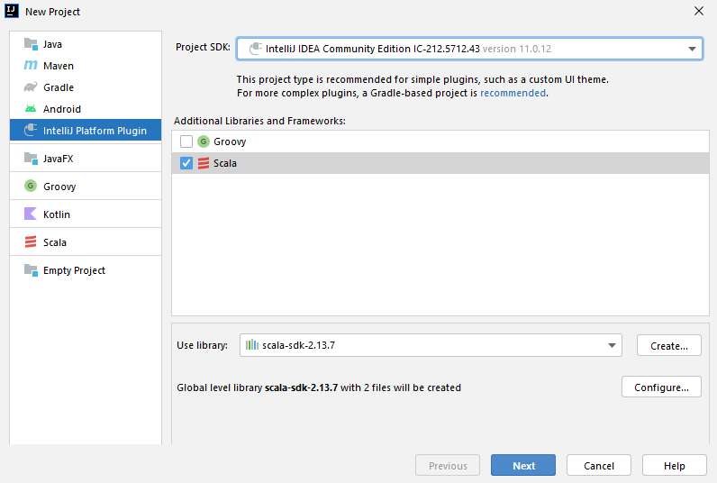
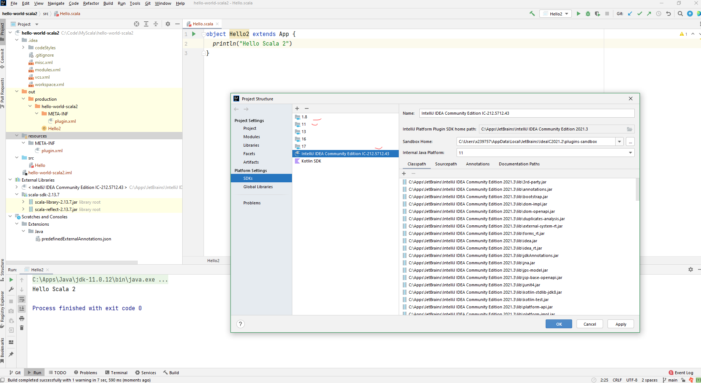

# Install Scala 2 in Windows

## Install JDK 8 or 11

C:\Apps\Java\jdk1.8.0_291

C:\Apps\Java\jdk-11.0.12

## Install IntelliJ

ideaIC-2021.3.exe

### Install Scala plugin

### Hello Scala 2

Select 1.8, 11 or IJ SDK

## Other choice: install sbt

## Misc

JDK for compiler process not found: Unexpected sdk type: 'IDEA JDK' for sdk IntelliJ IDEA Community Edition IC-212.5712.43: version 11.0.12 (C:/Apps/JetBrains/IntelliJ IDEA Community Edition 2021.3)
