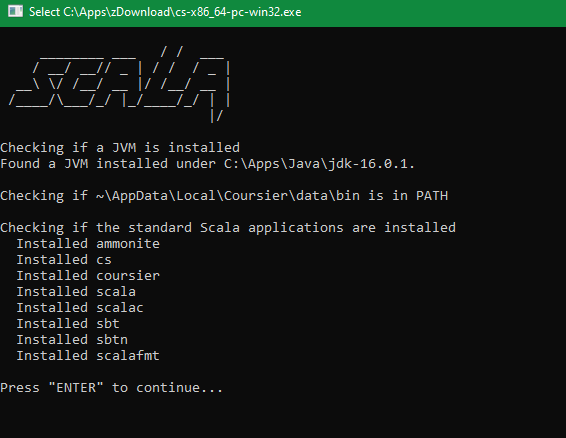
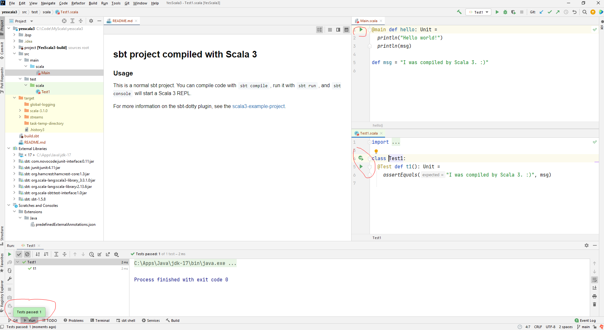
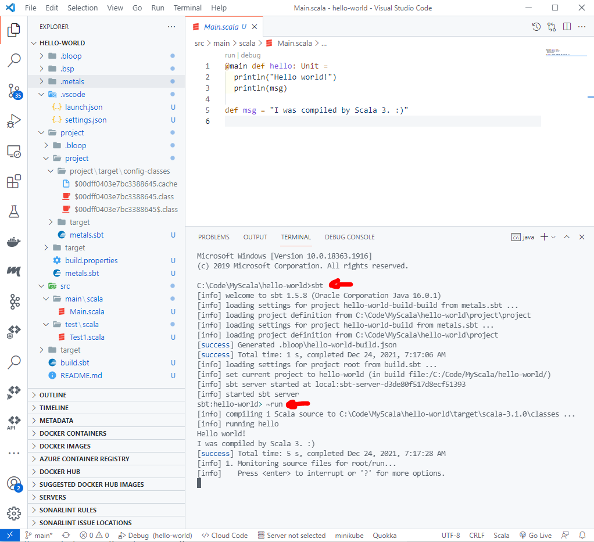
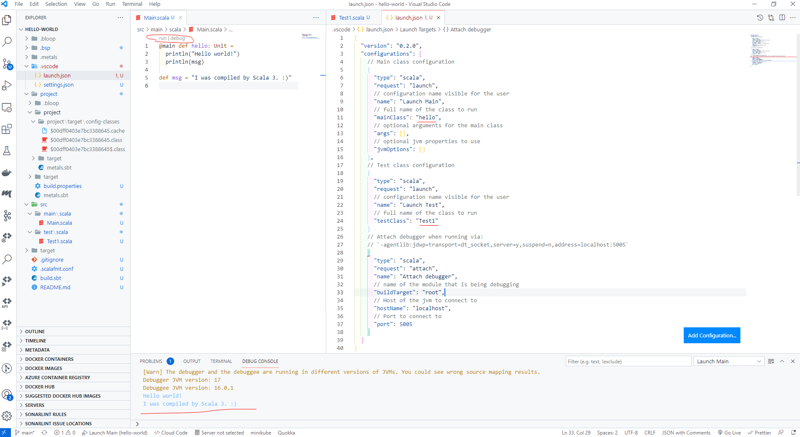
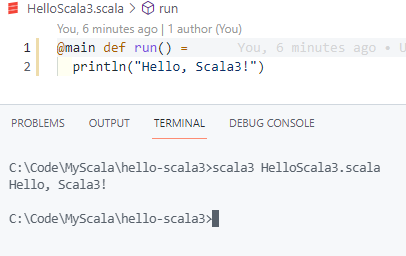

# Install Scala 3 in Windows

## Install with the Scala Installer (recommended way)

https://git.io/coursier-cli-windows-exe



```
cs install scala3-compiler
cs install scala3
```

## Install with sbt (my recommended way)

- install JDK

- install sbt

https://www.scala-sbt.org/download.html

C:\Apps\sbt\

## Use IntelliJ as Scala IDE

### Install Scala plugin

https://plugins.jetbrains.com/plugin/1347-scala

## Set up Java SDK

Choose jdk 17

## Set up Scala SDK

Download 3.1.0

C:\Users\...\.ivy2\cache

### Create a new Scala3 project with sbt

sbt new scala/scala3.g8

YesScala3

```dos
C:\Code\MyScala>sbt new scala/scala3.g8
WARNING: A terminally deprecated method in java.lang.System has been called
WARNING: System::setSecurityManager has been called by sbt.TrapExit$ (file:/C:/Users/x239757/.sbt/boot/scala-2.12.14/org.scala-sbt/sbt/1.5.8/run_2.12-1.5.8.jar)
WARNING: Please consider reporting this to the maintainers of sbt.TrapExit$
WARNING: System::setSecurityManager will be removed in a future release
[info] welcome to sbt 1.5.8 (Oracle Corporation Java 17)
[info] set current project to new (in build file:/C:/Users/x239757/AppData/Local/Temp/sbt_78b9ca43/new/)

A template to demonstrate a minimal Scala 3 application

name [Scala 3 Project Template]: YesScala3

Template applied in C:\Code\MyScala\.\yesscala3
```

### Open Scala3 project with IntelliJ

Very simple.




## Use VSC as Scala IDE

### Install the Metals extension

### Metals settings in VSC

Ctrl+,

settings.json

```
  "metals.sbtScript": "C:\\Apps\\sbt",
  "java.home": "C:\\Apps\\Java\\jdk-17",
  "metals.javaHome": "C:\\Apps\\Java\\jdk-17"
```

### Create a new Scala3 project with sbt

sbt new scala/scala3.g8

```dos
C:\Code\MyScala>sbt new scala/scala3.g8
[info] [launcher] getting org.scala-sbt sbt 1.5.8  (this may take some time)...
[info] [launcher] getting Scala 2.12.14 (for sbt)...
[info] welcome to sbt 1.5.8 (Oracle Corporation Java 16.0.1)
[info] set current project to new (in build file:/C:/Users/x239757/AppData/Local/Temp/sbt_7f0ee891/new/)
[info] downloading https://repo1.maven.org/maven2/org/scala-sbt/sbt-giter8-resolver/sbt-giter8-resolver_2.12/0.13.1/sbt-giter8-resolver_2.12-0.13.1.jar ...
[info] downloading https://repo1.maven.org/maven2/org/scala-lang/scala-library/2.12.14/scala-library-2.12.14.jar ...
...
[info] downloading https://repo1.maven.org/maven2/org/typelevel/macro-compat_2.12/1.1.1/macro-compat_2.12-1.1.1.jar ...
[info]  [SUCCESSFUL ] org.fusesource.jansi#jansi;1.18!jansi.jar (131ms)
[info]  [SUCCESSFUL ] net.java.dev.jna#jna-platform;4.1.0!jna-platform.jar (381ms)
[info]  [SUCCESSFUL ] io.argonaut#argonaut_2.12;6.2.4!argonaut_2.12.jar (140ms)
[info]  [SUCCESSFUL ] org.typelevel#macro-compat_2.12;1.1.1!macro-compat_2.12.jar (116ms)
[info]  [SUCCESSFUL ] com.chuusai#shapeless_2.12;2.3.3!shapeless_2.12.jar(bundle) (355ms)
[info]  [SUCCESSFUL ] org.scala-lang#scala-reflect;2.12.14!scala-reflect.jar (579ms)
[info] resolving Giter8 0.13.1...

A template to demonstrate a minimal Scala 3 application

A template to demonstrate a minimal Scala 3 application

name [Scala 3 Project Template]: hello-world

Template applied in C:\Code\MyScala\.\hello-world
```

### Open Scala3 project with VSC

Import build

Run with sbt

```dos
sbt
~run
```



```dos
C:\Code\MyScala\hello-world>sbt
[info] welcome to sbt 1.5.8 (Oracle Corporation Java 16.0.1)
[info] loading settings for project hello-world-build-build from metals.sbt ...
[info] loading project definition from C:\Code\MyScala\hello-world\project\project
[info] loading settings for project hello-world-build from metals.sbt ...
[info] loading project definition from C:\Code\MyScala\hello-world\project
[success] Generated .bloop\hello-world-build.json
[success] Total time: 1 s, completed Dec 24, 2021, 7:17:06 AM
[info] loading settings for project root from build.sbt ...
[info] set current project to hello-world (in build file:/C:/Code/MyScala/hello-world/)
[info] sbt server started at local:sbt-server-d3de80f517d8ecf51393
[info] started sbt server
sbt:hello-world> ~run
[info] compiling 1 Scala source to C:\Code\MyScala\hello-world\target\scala-3.1.0\classes ...
[info] running hello
Hello world!
I was compiled by Scala 3. :)
[success] Total time: 5 s, completed Dec 24, 2021, 7:17:28 AM
[info] 1. Monitoring source files for root/run...
[info]    Press <enter> to interrupt or '?' for more options.
```

### Run Scala3 project in VSC

- via code lenses



- via a launch.json configuration


launch.json

```json
{
  "version": "0.2.0",
  "configurations": [
    // Main class configuration
    {
      "type": "scala",
      "request": "launch",
      // configuration name visible for the user
      "name": "Launch Main",
      // full name of the class to run
      "mainClass": "hello",
      // optional arguments for the main class
      "args": [],
      // optional jvm properties to use
      "jvmOptions": []
    },
    // Test class configuration
    {
      "type": "scala",
      "request": "launch",
      // configuration name visible for the user
      "name": "Launch Test",
      // full name of the class to run
      "testClass": "Test1"
    }
    // Attach debugger when running via:
    // `-agentlib:jdwp=transport=dt_socket,server=y,suspend=n,address=localhost:5005`
    {
      "type": "scala",
      "request": "attach",
      "name": "Attach debugger",
      // name of the module that is being debugging
      "buildTarget": "root",
      // Host of the jvm to connect to
      "hostName": "localhost",
      // Port to connect to
      "port": 5005
    }
  ]
}
```

## Install Coursier

```dos
> bitsadmin /transfer cs-cli https://git.io/coursier-cli-windows-exe "%cd%\cs.exe"
> .\cs --help
```

```dos
DISPLAY: 'cs-cli' TYPE: DOWNLOAD STATE: TRANSFERRED
PRIORITY: NORMAL FILES: 1 / 1 BYTES: 58251264 / 58251264 (100%)
Transfer complete.

23/12/2021  05:49 PM        58,251,264 cs.exe
```

or

https://git.io/coursier-cli-windows-exe

## Install Scala 3 with Coursier

```dos
cs install scala3-compiler
cs install scala3
```

```dos
c:\tmp>cs install scala3-compiler
https://repo1.maven.org/maven2/io/get-coursier/apps/maven-metadata.xml
  100.0% [##########] 2.1 KiB (5.7 KiB / s)
https://repo1.maven.org/maven2/org/scala-lang/scala3-compiler_3/maven-metadata.xml
  100.0% [##########] 11.6 KiB (196.7 KiB / s)
https://repo1.maven.org/maven2/org/scala-lang/scala3-compiler_3/3.1.0/scala3-compiler_3-3.1.0.pom
  100.0% [##########] 4.8 KiB (106.3 KiB / s)
https://repo1.maven.org/maven2/org/jline/jline-terminal-jna/3.19.0/jline-terminal-jna-3.19.0.pom
  100.0% [##########] 1.8 KiB (31.0 KiB / s)
https://repo1.maven.org/maven2/org/jline/jline-terminal/3.19.0/jline-terminal-3.19.0.pom
  100.0% [##########] 1.2 KiB (12.5 KiB / s)
https://repo1.maven.org/maven2/org/scala-lang/modules/scala-asm/9.1.0-scala-1/scala-asm-9.1.0-scala-1.pom
  100.0% [##########] 1.5 KiB (14.8 KiB / s)
https://repo1.maven.org/maven2/org/scala-lang/tasty-core_3/3.1.0/tasty-core_3-3.1.0.pom
  100.0% [##########] 3.5 KiB (30.0 KiB / s)
https://repo1.maven.org/maven2/org/jline/jline-reader/3.19.0/jline-reader-3.19.0.pom
  100.0% [##########] 1.2 KiB (7.5 KiB / s)
https://repo1.maven.org/maven2/org/scala-lang/scala3-interfaces/3.1.0/scala3-interfaces-3.1.0.pom
  100.0% [##########] 3.4 KiB (32.3 KiB / s)
https://repo1.maven.org/maven2/org/scala-sbt/compiler-interface/1.3.5/compiler-interface-1.3.5.pom
  100.0% [##########] 2.8 KiB (17.8 KiB / s)
https://repo1.maven.org/maven2/org/scala-lang/scala3-library_3/3.1.0/scala3-library_3-3.1.0.pom
  100.0% [##########] 3.6 KiB (42.3 KiB / s)
https://repo1.maven.org/maven2/org/jline/jline-parent/3.19.0/jline-parent-3.19.0.pom
  100.0% [##########] 23.0 KiB (426.0 KiB / s)
https://repo1.maven.org/maven2/org/sonatype/oss/oss-parent/9/oss-parent-9.pom
  100.0% [##########] 6.4 KiB (145.8 KiB / s)
https://repo1.maven.org/maven2/com/google/protobuf/protobuf-java/3.7.0/protobuf-java-3.7.0.pom
  100.0% [##########] 5.2 KiB (86.4 KiB / s)
https://repo1.maven.org/maven2/org/scala-sbt/util-interface/1.3.0/util-interface-1.3.0.pom
  100.0% [##########] 2.7 KiB (45.2 KiB / s)
https://repo1.maven.org/maven2/net/java/dev/jna/jna/5.3.1/jna-5.3.1.pom
  100.0% [##########] 1.5 KiB (19.3 KiB / s)
https://repo1.maven.org/maven2/org/scala-lang/scala-library/2.13.6/scala-library-2.13.6.pom
  100.0% [##########] 1.6 KiB (19.5 KiB / s)
https://repo1.maven.org/maven2/com/google/protobuf/protobuf-parent/3.7.0/protobuf-parent-3.7.0.pom
  100.0% [##########] 7.1 KiB (108.7 KiB / s)
https://repo1.maven.org/maven2/org/scala-lang/scala3-interfaces/3.1.0/scala3-interfaces-3.1.0.jar
  100.0% [##########] 3.4 KiB (57.4 KiB / s)
https://repo1.maven.org/maven2/org/jline/jline-terminal-jna/3.19.0/jline-terminal-jna-3.19.0.jar
  100.0% [##########] 61.7 KiB (514.2 KiB / s)
https://repo1.maven.org/maven2/org/jline/jline-reader/3.19.0/jline-reader-3.19.0.jar
  100.0% [##########] 166.6 KiB (1.5 MiB / s)
https://repo1.maven.org/maven2/org/scala-lang/tasty-core_3/3.1.0/tasty-core_3-3.1.0.jar
  100.0% [##########] 71.8 KiB (1.3 MiB / s)
https://repo1.maven.org/maven2/org/scala-sbt/util-interface/1.3.0/util-interface-1.3.0.jar
  100.0% [##########] 2.5 KiB (42.6 KiB / s)
https://repo1.maven.org/maven2/net/java/dev/jna/jna/5.3.1/jna-5.3.1.jar
  100.0% [##########] 1.4 MiB (4.8 MiB / s)
https://repo1.maven.org/maven2/org/scala-sbt/compiler-interface/1.3.5/compiler-interface-1.3.5.jar
  100.0% [##########] 90.3 KiB (799.1 KiB / s)
https://repo1.maven.org/maven2/org/scala-lang/modules/scala-asm/9.1.0-scala-1/scala-asm-9.1.0-scala-1.jar
  100.0% [##########] 304.8 KiB (1.8 MiB / s)
https://repo1.maven.org/maven2/org/scala-lang/scala3-library_3/3.1.0/scala3-library_3-3.1.0.jar
  100.0% [##########] 1.1 MiB (3.6 MiB / s)
https://repo1.maven.org/maven2/org/jline/jline-terminal/3.19.0/jline-terminal-3.19.0.jar
  100.0% [##########] 223.1 KiB (2.5 MiB / s)
https://repo1.maven.org/maven2/com/google/protobuf/protobuf-java/3.7.0/protobuf-java-3.7.0.jar
  100.0% [##########] 1.4 MiB (8.8 MiB / s)
https://repo1.maven.org/maven2/org/scala-lang/scala-library/2.13.6/scala-library-2.13.6.jar
  100.0% [##########] 5.7 MiB (10.9 MiB / s)
https://repo1.maven.org/maven2/org/scala-lang/scala3-compiler_3/3.1.0/scala3-compiler_3-3.1.0.jar
  100.0% [##########] 16.2 MiB (10.0 MiB / s)
Wrote scala3-compiler
Warning: C:\Users\...\AppData\Local\Coursier\data\bin is not in your PATH
```

```dos
c:\tmp>cs install scala3
https://repo1.maven.org/maven2/org/scala-lang/scala3-compiler_3/maven-metadata.xml
  No new update since 2021-12-22 23:22:00
https://repo1.maven.org/maven2/org/scala-lang/scala3-compiler_3/maven-metadata.xml
  No new update since 2021-12-22 23:22:00
https://repo1.maven.org/maven2/org/scala-lang/scala3-compiler_3/3.1.2-RC1-bin-20211222-c94b333-NIGHTLY/scala3-compiler_3-3.1.2-RC1-bin-20211222-c94b333-NIGHTLY.pom
  100.0% [##########] 4.9 KiB (87.7 KiB / s)
https://repo1.maven.org/maven2/org/scala-lang/tasty-core_3/3.1.2-RC1-bin-20211222-c94b333-NIGHTLY/tasty-core_3-3.1.2-RC1-bin-20211222-c94b333-NIGHTLY.pom
  100.0% [##########] 3.7 KiB (63.9 KiB / s)
https://repo1.maven.org/maven2/org/scala-lang/scala3-interfaces/3.1.2-RC1-bin-20211222-c94b333-NIGHTLY/scala3-interfaces-3.1.2-RC1-bin-20211222-c94b333-NIGHTLY.pom
  100.0% [##########] 3.5 KiB (30.1 KiB / s)
https://repo1.maven.org/maven2/org/scala-lang/scala3-library_3/3.1.2-RC1-bin-20211222-c94b333-NIGHTLY/scala3-library_3-3.1.2-RC1-bin-20211222-c94b333-NIGHTLY.pom
  100.0% [##########] 3.7 KiB (31.7 KiB / s)
https://repo1.maven.org/maven2/org/scala-lang/scala3-interfaces/3.1.2-RC1-bin-20211222-c94b333-NIGHTLY/scala3-interfaces-3.1.2-RC1-bin-20211222-c94b333-NIGHTLY.jar
  100.0% [##########] 3.5 KiB (49.0 KiB / s)
https://repo1.maven.org/maven2/org/scala-lang/tasty-core_3/3.1.2-RC1-bin-20211222-c94b333-NIGHTLY/tasty-core_3-3.1.2-RC1-bin-20211222-c94b333-NIGHTLY.jar
  100.0% [##########] 72.1 KiB (1015.8 KiB / s)
https://repo1.maven.org/maven2/org/scala-lang/scala3-library_3/3.1.2-RC1-bin-20211222-c94b333-NIGHTLY/scala3-library_3-3.1.2-RC1-bin-20211222-c94b333-NIGHTLY.jar
  100.0% [##########] 1.2 MiB (4.4 MiB / s)
https://repo1.maven.org/maven2/org/scala-lang/scala3-compiler_3/3.1.2-RC1-bin-20211222-c94b333-NIGHTLY/scala3-compiler_3-3.1.2-RC1-bin-20211222-c94b333-NIGHTLY.jar
  100.0% [##########] 16.4 MiB (18.4 MiB / s)
Wrote scala3
Warning: C:\Users\...\AppData\Local\Coursier\data\bin is not in your PATH
```

## Edit PATH environment

Add "C:\Users\...\AppData\Local\Coursier\data\bin" to PATH

## Test Scala 3

```dos
scala3
```

```dos
c:\tmp>scala3
Welcome to Scala 3.1.2-RC1-bin-20211222-c94b333-NIGHTLY-git-c94b333 (16.0.1, Java Java HotSpot(TM) 64-Bit Server VM).
Type in expressions for evaluation. Or try :help.

scala> :help
The REPL has several commands available:

:help                    print this summary
:load <path>             interpret lines in a file
:quit                    exit the interpreter
:type <expression>       evaluate the type of the given expression
:doc <expression>        print the documentation for the given expression
:imports                 show import history
:reset                   reset the repl to its initial state, forgetting all session entries
:settings <options>      update compiler options, if possible


scala> :quit
```



## Install Scala 3 with GitHub download

https://github.com/lampepfl/dotty/releases/tag/3.1.0

## Scastie - Scala playground

Scastie is an online “playground” where you can experiment with Scala examples to see how things work, with access to all Scala compilers and published libraries.

https://scastie.scala-lang.org/
