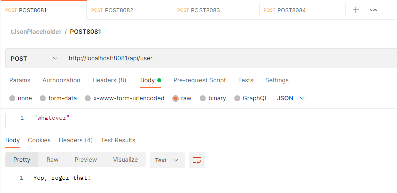
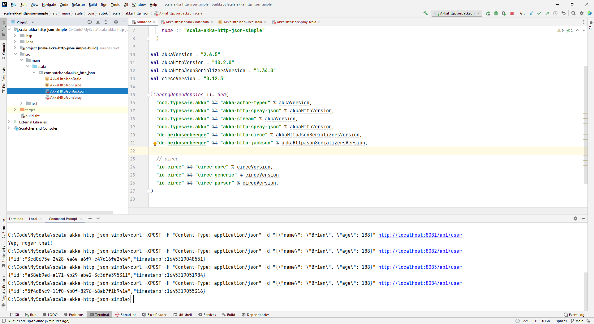

# Akka HTTP & JSON: Integrating Spray, Circe and Jackson with Akka HTTP, with Scala

## 3 libraries

- None (without anything of these 3 supports)

- Spray


- Circe

    A JSON library for Scala powered by Cats

- Jackson


## Code


```dos
val akkaVersion = "2.6.5"
val akkaHttpVersion = "10.2.0"
val akkaHttpJsonSerializersVersion = "1.34.0"
val circeVersion = "0.12.3"

libraryDependencies ++= Seq(
  "com.typesafe.akka" %% "akka-actor-typed" % akkaVersion,
  "com.typesafe.akka" %% "akka-http-spray-json" % akkaHttpVersion,
  "com.typesafe.akka" %% "akka-stream" % akkaVersion,
  "com.typesafe.akka" %% "akka-http-spray-json" % akkaHttpVersion,
  "de.heikoseeberger" %% "akka-http-circe" % akkaHttpJsonSerializersVersion,
  "de.heikoseeberger" %% "akka-http-jackson" % akkaHttpJsonSerializersVersion,

  // circe
  "io.circe" %% "circe-core" % circeVersion,
  "io.circe" %% "circe-generic" % circeVersion,
  "io.circe" %% "circe-parser" % circeVersion,
)
```


```
curl -XPOST -H "Content-Type: application/json" -d "whatever" http://localhost:8081/api/user
curl -XPOST -H "Content-Type: application/json" -d "{\"name\": \"Brian\", \"age\": 88}" http://localhost:8082/api/user
curl -XPOST -H "Content-Type: application/json" -d "{\"name\": \"Brian\", \"age\": 88}" http://localhost:8083/api/user
curl -XPOST -H "Content-Type: application/json" -d "{\"name\": \"Brian\", \"age\": 88}" http://localhost:8084/api/user
```


```
echo http post localhost:8081/api/user
echo "whatever" | http post localhost:8081/api/user
```




