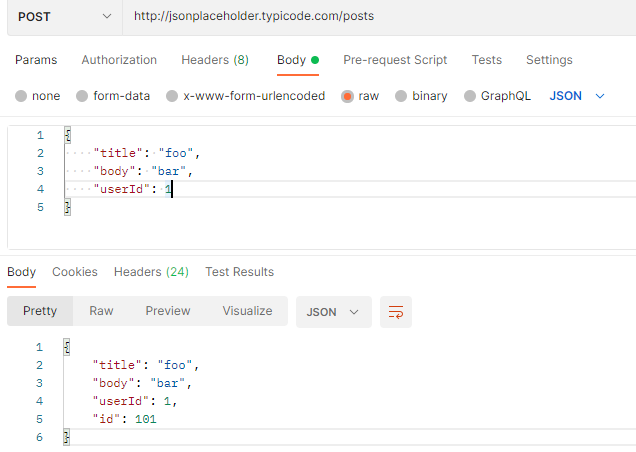
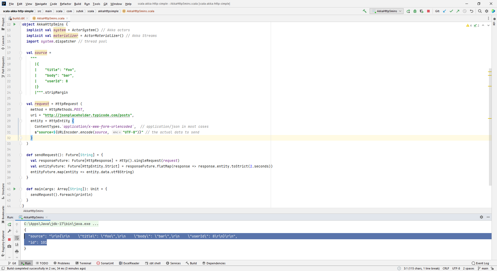

# Sending HTTP Requests with Scala & Akka HTTP


## JSonPlaceHolder




## Use http instead of https for jsonplaceholder.typicode.com

Use https will throw SSL exception


## code

```scala
package com.sutek.scala.akkahttpsimple

import akka.actor.ActorSystem
import akka.http.scaladsl.Http
import akka.http.scaladsl.model._
import akka.stream.ActorMaterializer

import java.net.URLEncoder
import scala.concurrent.Future
import scala.concurrent.duration._

object AkkaHttp5mins {
  implicit val system = ActorSystem() // Akka actors
  implicit val materializer = ActorMaterializer() // Akka Streams
  import system.dispatcher // thread pool

  val source =
    """
      |{
      |    "title": "foo",
      |    "body": "bar",
      |    "userId": 8
      |}
      |""".stripMargin

  val request = HttpRequest (
    method = HttpMethods.POST,
    uri = "http://jsonplaceholder.typicode.com/posts",
    entity = HttpEntity (
      ContentTypes.`application/x-www-form-urlencoded`,  // application/json in most cases
      s"source=${URLEncoder.encode(source, "UTF-8")}" // the actual data to send
    )
  )

  def sendRequest(): Future[String] = {
    val responseFuture: Future[HttpResponse] = Http().singleRequest(request)
    val entityFuture: Future[HttpEntity.Strict] = responseFuture.flatMap(response => response.entity.toStrict(2.seconds))
    entityFuture.map(entity => entity.data.utf8String)
  }

  def main(args: Array[String]): Unit = {
    sendRequest().foreach(println)
  }
}
```



