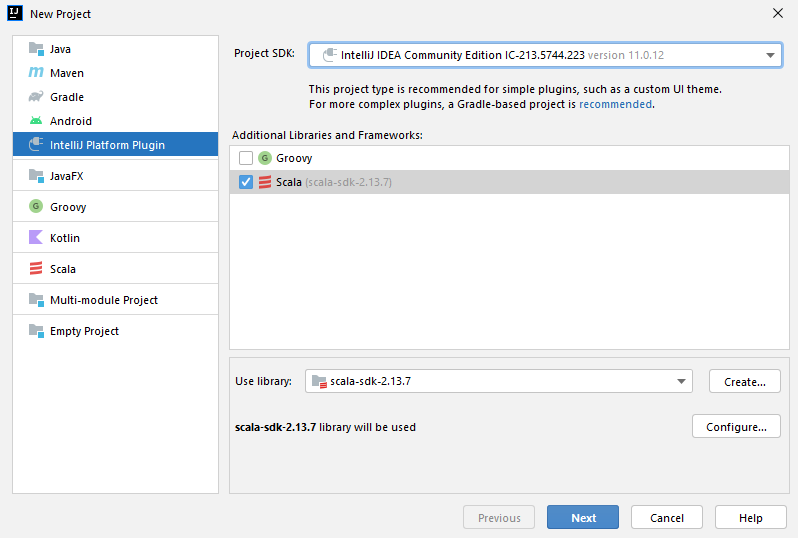
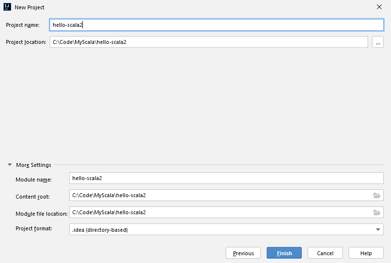
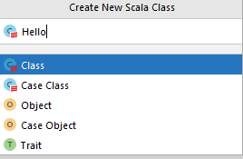
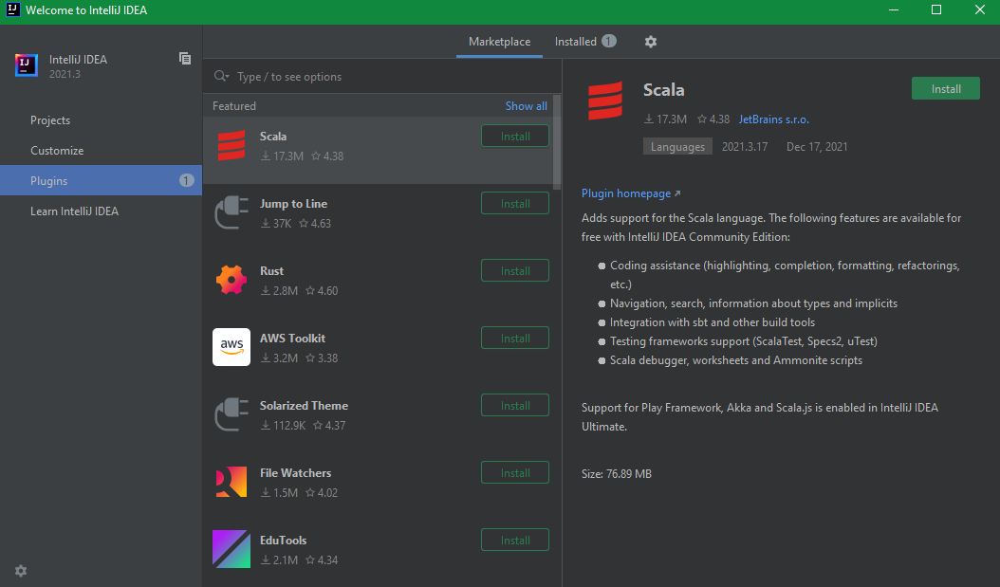
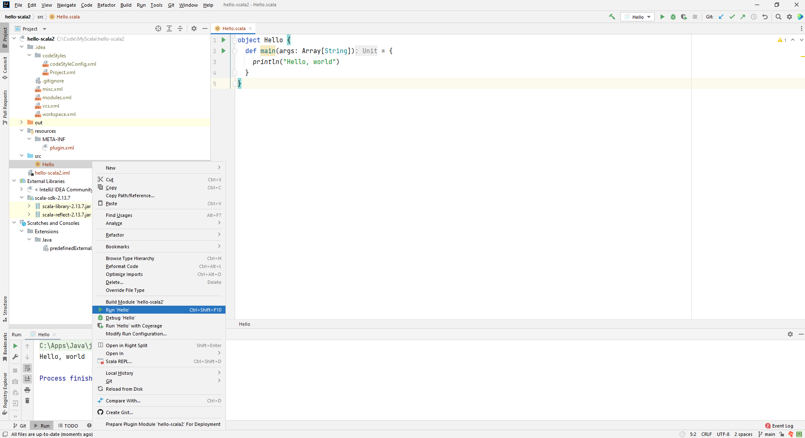

# Hello Scala 2

## Create a new project in IntelliJ

C:\Apps\Java\jdk1.8.0_291

C:\Apps\Java\jdk-11.0.12





## Create a new Scala 2 class



object: object is the keyword which is used to create the objects. Objects are the instance of a class. Here “Geeks” is the name of the object.

def main(args: Array[String]): def is the keyword in Scala which is used to define the function and “main” is the name of Main Method. args: Array[String] are used for the command line arguments.

println(“Hello Scala 2”): println is a method in Scala which is used to display the Output on console.

## Choose Scala plugin



## Run the Scala 2 class



## Scalac

```dos
C:\Code\MyScala\hello-scala2\src>scalac Hello.scala

C:\Code\MyScala\hello-scala2\src>dir
 Volume in drive C is L113220
 Volume Serial Number is E8F0-3AB6

 Directory of C:\Code\MyScala\hello-scala2\src

26/12/2021  09:16 PM    <DIR>          .
26/12/2021  09:16 PM    <DIR>          ..
26/12/2021  09:16 PM               664 Hello$.class
26/12/2021  09:16 PM               675 Hello.class
26/12/2021  08:35 PM                89 Hello.scala
               3 File(s)          1,428 bytes
               2 Dir(s)  101,581,197,312 bytes free
```
