# Scala Interview Questions

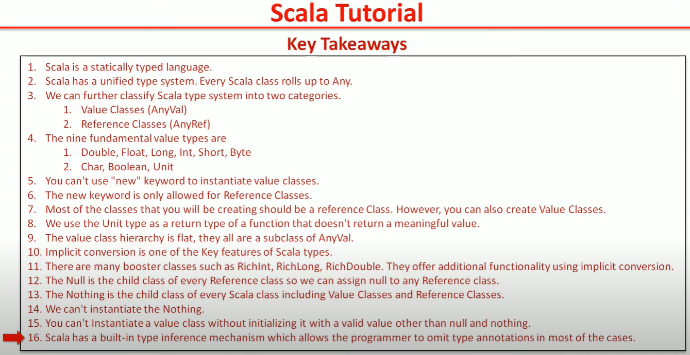

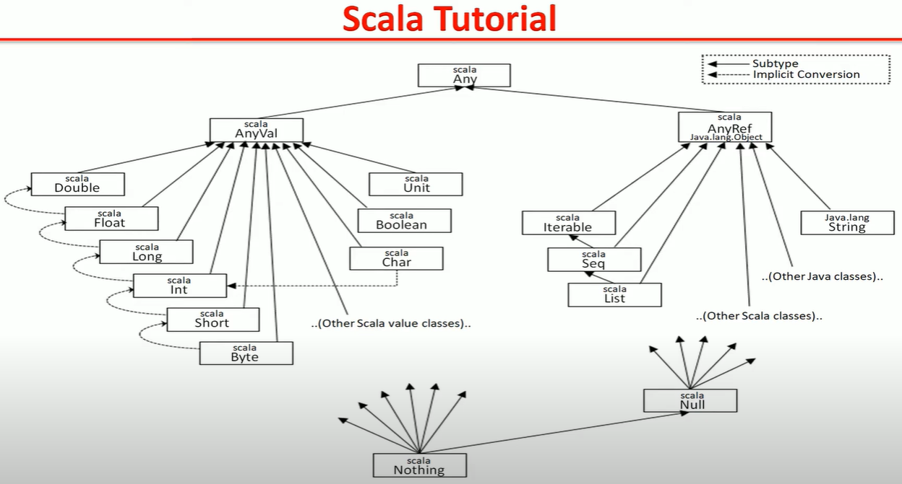


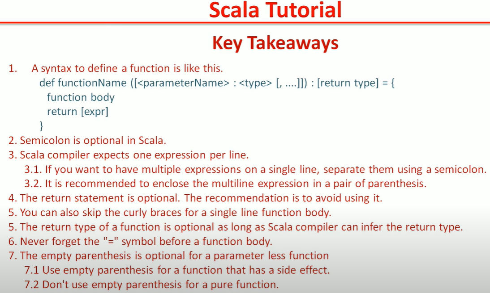

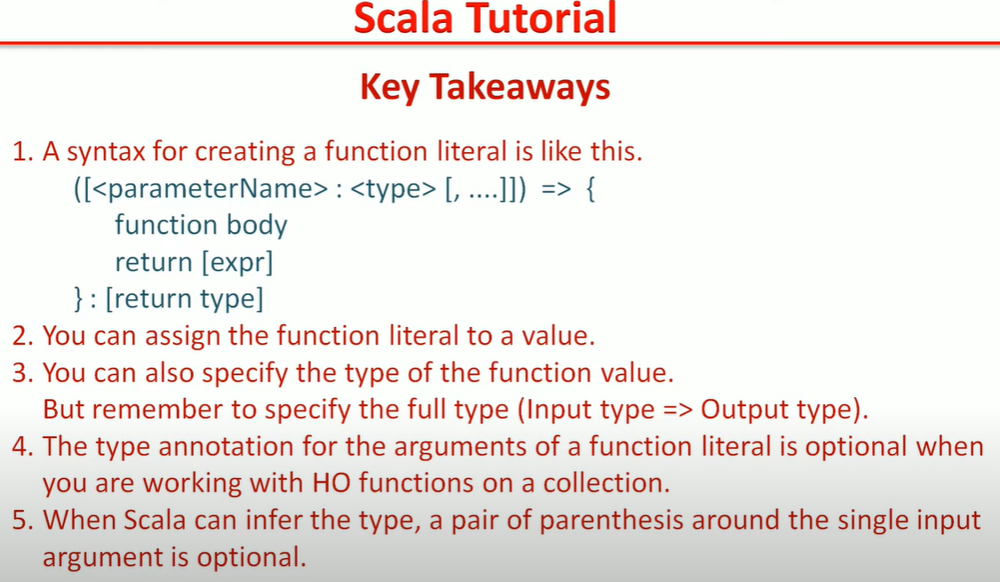

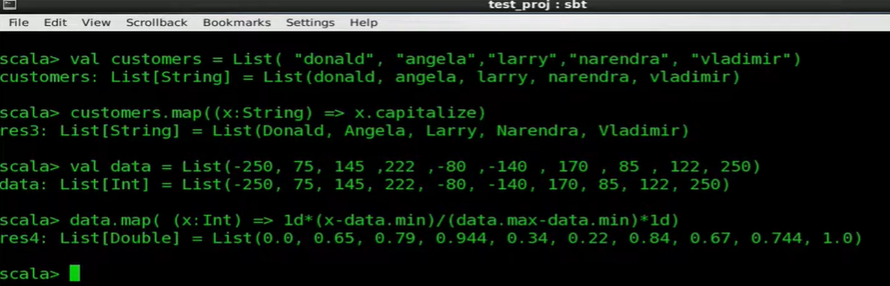

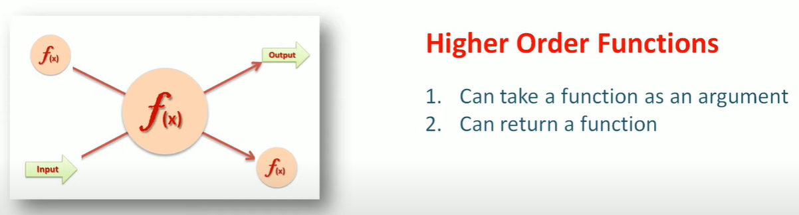

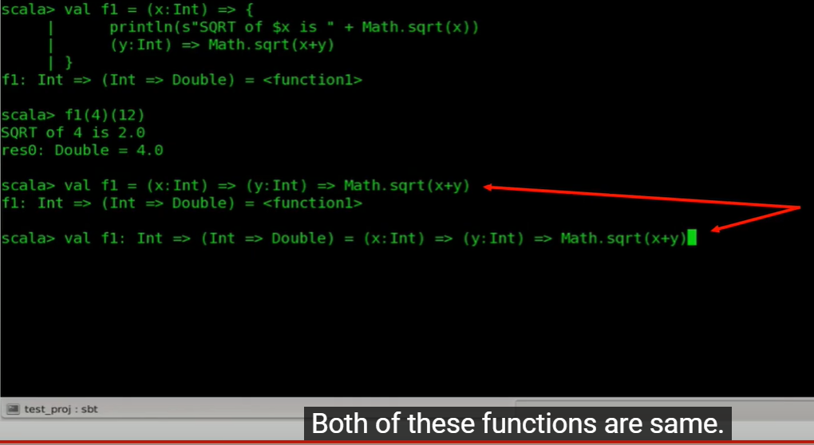

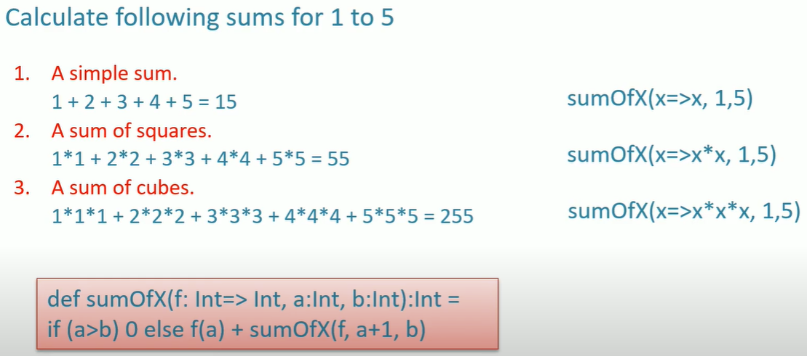

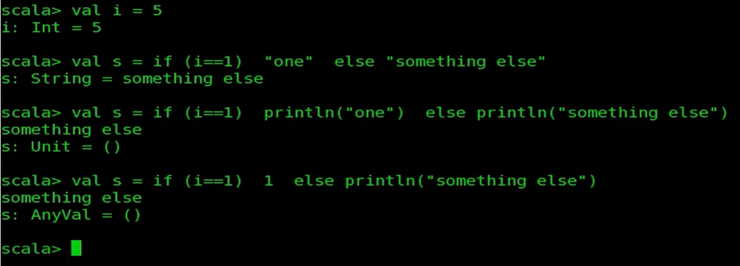

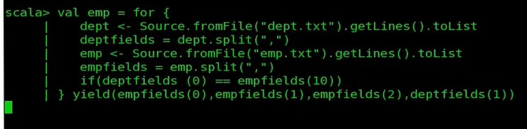

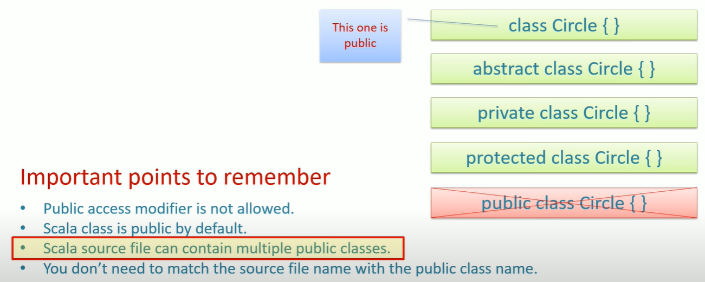

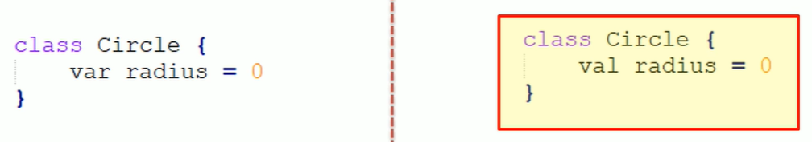

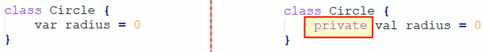

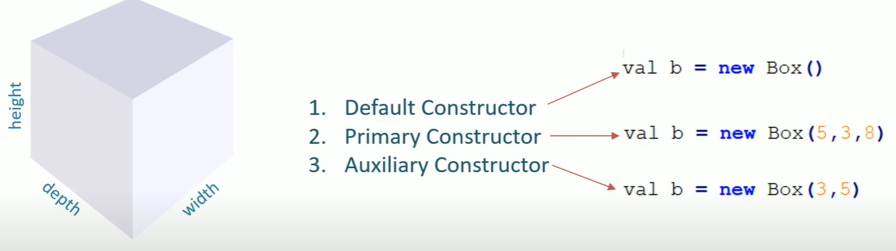

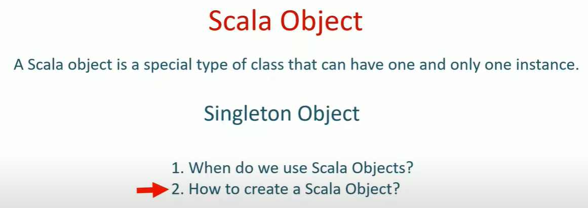

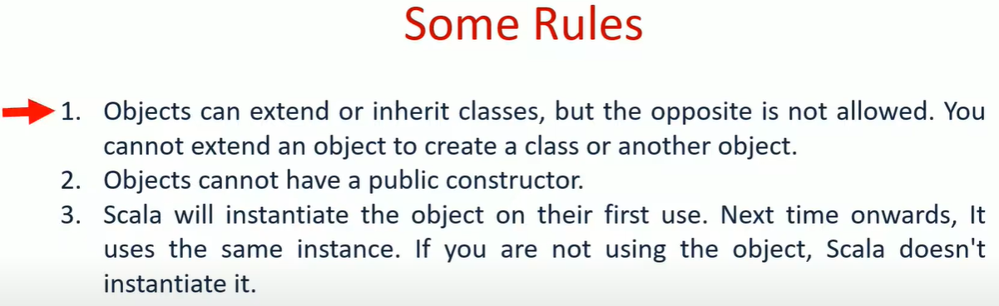

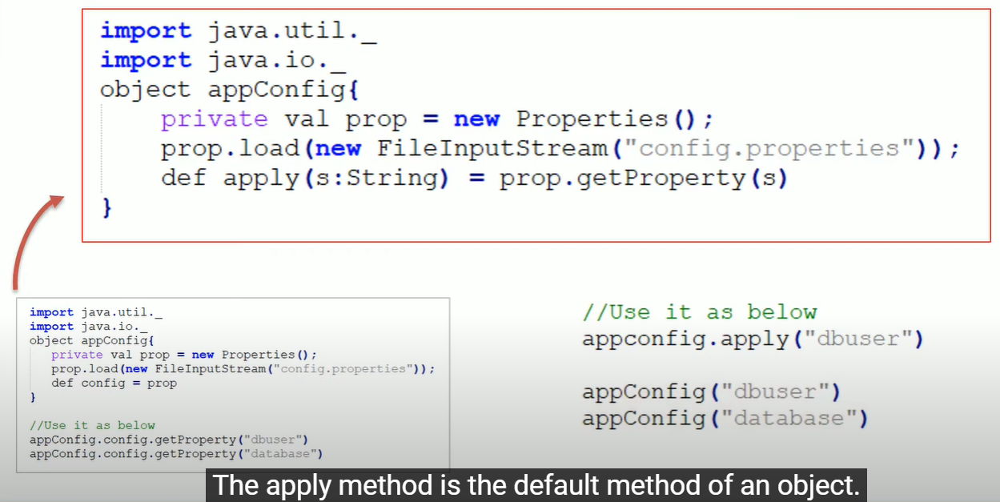

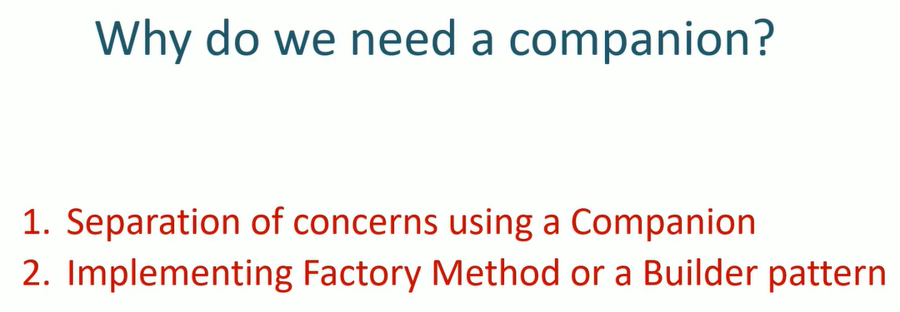

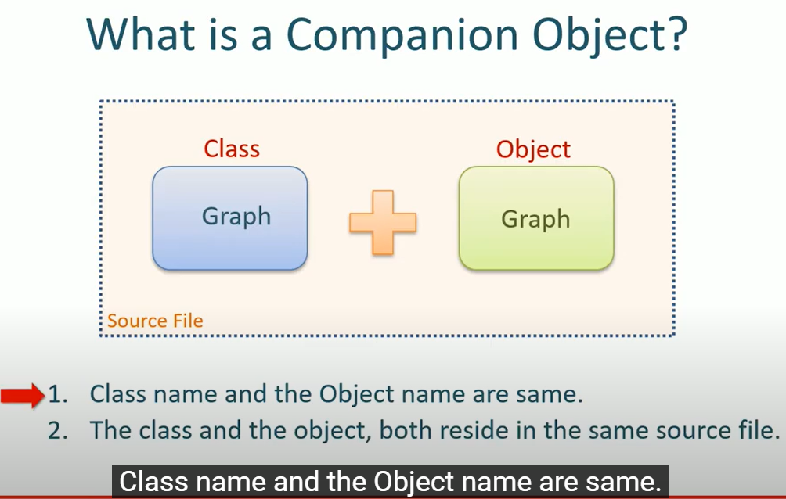

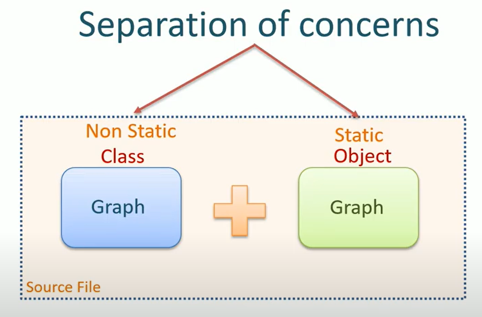

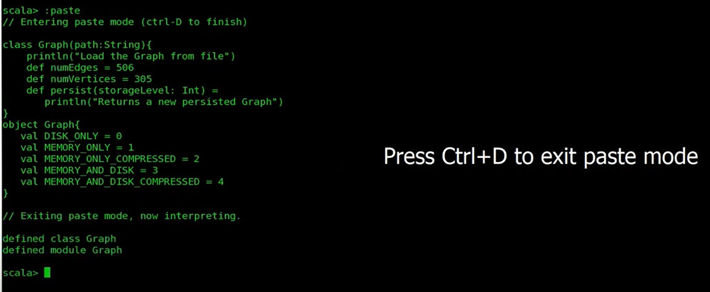

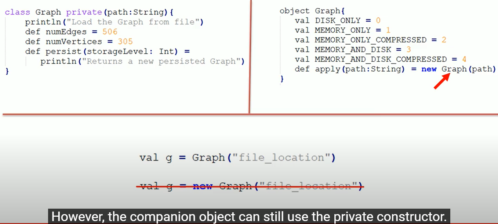

Scala provides three string interpolation methods out of the box: s, f and raw.

The f interpolator is typesafe.

If you try to pass a format string that only works for integers but pass a double, the compiler will issue an error.

In Scala, all processed string literals are simple code transformations. Anytime the compiler encounters a string literal of the form:

```
id"string content"
```

it transforms it into a method call (id) on an instance of StringContext.
