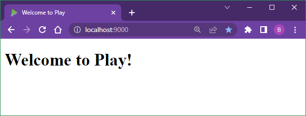
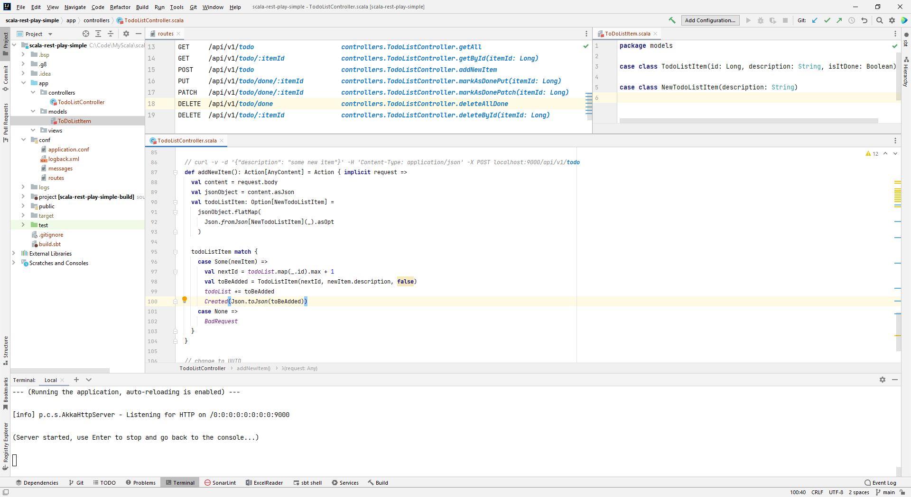
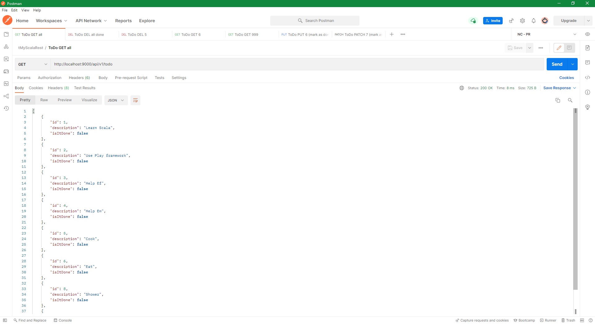
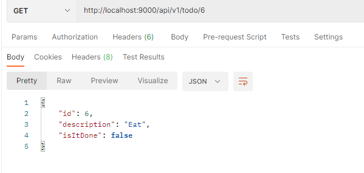
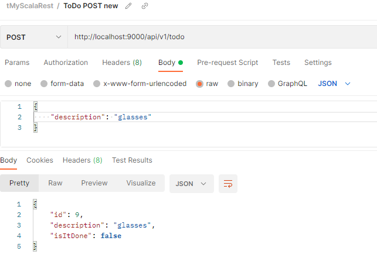
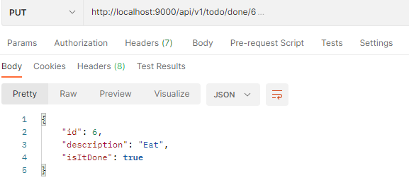
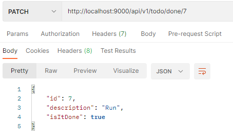
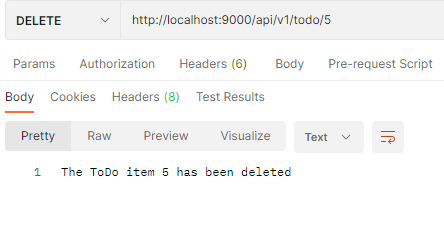
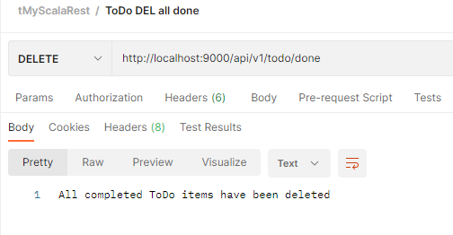
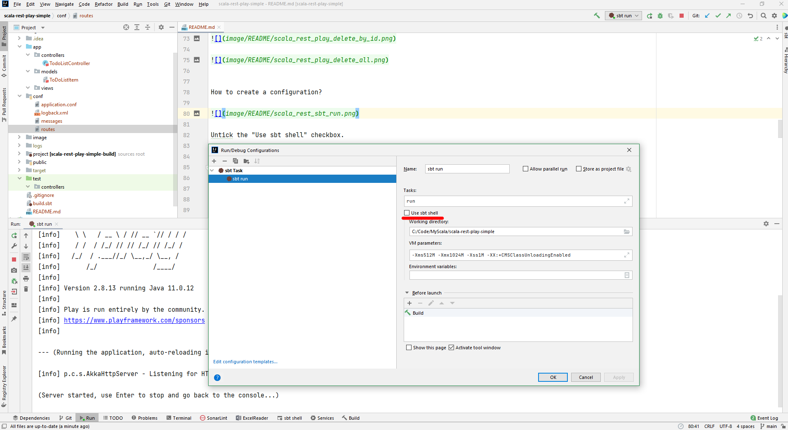

# Building a REST API in Scala with Play Framework


```dos
sbt new playframework/play-scala-seed.g8

cd scala-rest-play-simple

sbt run

http://localhost:9000
```




Open the folder in IntelliJ.

Change the JDK to v11.

(Optional)

remove app/controllers/HomeController.scala, app/views/index.scala.html, app/views/main.scala.html, and
test/controllers/HomeController.spec.scala files. 

Also cleanup the content in the "conf/routes" file.


```
@Singleton
@Inject
```

```dos
Json.format
BaseController
ControllerComponents
NoContent
OK
Accepted
NotFound
Created
BadRequest
```


Once it starts, it will automatically "refresh" itself with your code changes - but in the lazy way :-)


```
curl localhost:9000/api/v1/todo
curl localhost:9000/api/v1/todo/1
curl -v -d '{"description": "some new item"}' -H 'Content-Type: application/json' -X POST localhost:9000/api/v1/todo
curl -X PUT localhost:9000/api/v1/todo/done/1
curl -X PATCH localhost:9000/api/v1/todo/done/1
curl -X DELETE localhost:9000/api/v1/todo/done
curl -X DELETE localhost:9000/api/v1/todo/888
```


















How to create a configuration?



Untick the "Use sbt shell" checkbox.


```dos
C:\Code\MyScala>sbt new playframework/play-scala-seed.g8
[info] welcome to sbt 1.5.8 (Oracle Corporation Java 11.0.12)
[info] loading global plugins from C:\Users\...\.sbt\1.0\plugins
[info] set current project to new (in build file:/C:/Users/.../AppData/Local/Temp/sbt_2708936f/new/)

This template generates a Play Scala project 

name [play-scala-seed]: scala-rest-play-simple
organization [com.example]: com.sutek
play_version [2.8.13]: 
scala_version [2.13.8]: 

Template applied in C:\Code\MyScala\.\scala-rest-play-simple

C:\Code\MyScala>cd scala-rest-play-simple

C:\Code\MyScala\scala-rest-play-simple>sbt run
[info] [launcher] getting org.scala-sbt sbt 1.5.2  (this may take some time)...
[info] [launcher] getting Scala 2.12.13 (for sbt)...
[info] welcome to sbt 1.5.2 (Oracle Corporation Java 11.0.12)
[info] loading global plugins from C:\Users\x239757\.sbt\1.0\plugins
[info] loading settings for project scala-rest-play-simple-build from plugins.sbt ...
[info] loading project definition from C:\Code\MyScala\scala-rest-play-simple\project
[info] loading settings for project root from build.sbt ...
[info]   __              __
[info]   \ \     ____   / /____ _ __  __
[info]    \ \   / __ \ / // __ `// / / /
[info]    / /  / /_/ // // /_/ // /_/ /
[info]   /_/  / .___//_/ \__,_/ \__, /
[info]       /_/               /____/
[info]
[info] Version 2.8.13 running Java 11.0.12
[info]
[info] Play is run entirely by the community. If you want to keep using it please consider donating:
[info] https://www.playframework.com/sponsors
[info]

--- (Running the application, auto-reloading is enabled) ---

[info] p.c.s.AkkaHttpServer - Listening for HTTP on /0:0:0:0:0:0:0:0:9000

(Server started, use Enter to stop and go back to the console...)

[info] compiling 7 Scala sources and 1 Java source to C:\Code\MyScala\scala-rest-play-simple\target\scala-2.13\classes ...
[info] Non-compiled module 'compiler-bridge_2.13' for Scala 2.13.8. Compiling...
[info]   Compilation completed in 10.387s.
WARNING: An illegal reflective access operation has occurred
WARNING: Illegal reflective access by com.google.inject.internal.cglib.core.$ReflectUtils$1 (file:/C:/Users/x239757/AppData/Local/Coursier/Cache/v1/https/repo1.maven.org/maven2/com/google/inject/guice/4.2.3/guice-4.2.3.jar) to method java.lang.ClassLoader.defineClass(java.lang.String,byte[],int,int,java.security.ProtectionDomain)
WARNING: Please consider reporting this to the maintainers of com.google.inject.internal.cglib.core.$ReflectUtils$1
WARNING: Use --illegal-access=warn to enable warnings of further illegal reflective access operations
WARNING: All illegal access operations will be denied in a future release
2022-02-20 08:07:38 INFO  play.api.http.EnabledFilters  Enabled Filters (see <https://www.playframework.com/documentation/latest/Filters>):

    play.filters.csrf.CSRFFilter
    play.filters.headers.SecurityHeadersFilter
    play.filters.hosts.AllowedHostsFilter

2022-02-20 08:07:38 INFO  play.api.Play  Application started (Dev) (no global state)
2022-02-20 08:07:38 WARN  p.api.mvc.DefaultJWTCookieDataCodec  decode: cookie has invalid signature! message = JWT signature does not match locally computed signature. JWT validity cannot be asserted and should not be trusted.
2022-02-20 08:07:38 INFO  p.api.mvc.DefaultJWTCookieDataCodec  The JWT signature in the cookie does not match the locally computed signature with the server. This usually indicates the browser has a leftover cookie from another Play application, so clearing cookies may resolve this error message.
2022-02-20 08:07:38 WARN  p.api.mvc.DefaultJWTCookieDataCodec  decode: cookie has invalid signature! message = JWT signature does not match locally computed signature. JWT validity cannot be asserted and should not be trusted.
2022-02-20 08:07:38 INFO  p.api.mvc.DefaultJWTCookieDataCodec  The JWT signature in the cookie does not match the locally computed signature with the server. This usually indicates the browser has a leftover cookie from another Play application, so clearing cookies may resolve this error message.
2022-02-20 08:07:38 WARN  p.api.mvc.DefaultJWTCookieDataCodec  decode: cookie has invalid signature! message = JWT signature does not match locally computed signature. JWT validity cannot be asserted and should not be trusted.
2022-02-20 08:07:38 INFO  p.api.mvc.DefaultJWTCookieDataCodec  The JWT signature in the cookie does not match the locally computed signature with the server. This usually indicates the browser has a leftover cookie from another Play application, so clearing cookies may resolve this error message.
```

